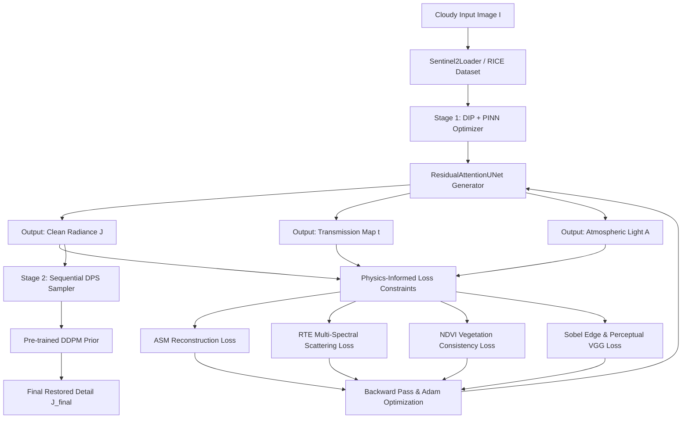

# CloudVision AI (CloudClear) — Master Project Specification

> **Comprehensive System Specification & Architecture Document**  
> Consolidating Product Requirements (PRD), Technical Requirements (TRD), Dataset Specifications, ML Architecture, Mathematical Formulations, Web UI/UX Specifications, API Contracts, and Implementation Plans.

---

## Table of Contents

1. [Executive Summary & PRD](#1-executive-summary--prd)
2. [System Architecture & Tech Stack](#2-system-architecture--tech-stack)
3. [Dataset Specification & Storage Layout](#3-dataset-specification--storage-layout)
4. [Machine Learning Pipeline & Model Stack](#4-machine-learning-pipeline--model-stack)
5. [Complete Mathematical Formulations](#5-complete-mathematical-formulations)
6. [Web Application Architecture & UI/UX Brief](#6-web-application-architecture--uiux-brief)
7. [API Contract & Schema Specifications](#7-api-contract--schema-specifications)
8. [Execution & Deployment Guide](#8-execution--deployment-guide)

---

## 1. Executive Summary & PRD

### 1.1 Overview
**CloudVision AI** (also known as **CloudClear**) is a full-stack, physics-informed satellite image restoration system. It combines a zero-shot **Deep Image Prior (DIP)** U-Net, **Physics-Informed Neural Network (PINN)** physical constraints, and **Diffusion Posterior Sampling (DPS)** to perform cloud removal on Sentinel-2 multispectral GeoTIFF imagery and RICE benchmark datasets.

Unlike traditional supervised deep learning models that require thousands of paired cloudy/clear ground-truth training images, CloudVision AI operates **without ground-truth clear imagery**, enforcing physical laws of light scattering through the atmosphere directly at inference time.

### 1.2 Core Problem Statement
Cloud cover frequently obstructs optical satellite imagery, degrading downstream remote sensing tasks such as agricultural crop monitoring, flood mapping, and land-use classification. CloudVision AI provides a physics-informed pipeline that removes clouds while preserving spectral and physical realism, accessible via an interactive web interface.

### 1.3 Core Features & Functional Requirements

| Feature ID | Name | Description & Implementation Status |
| :--- | :--- | :--- |
| **F1** | **Dataset Gallery** | Interactive browser across RICE1 (500 samples), RICE2 (736 samples), and Sentinel-2 GRANULE tiles. |
| **F2** | **Result Detail View** | Interactive before/after comparison slider, metric cards (PSNR, SSIM, SAM, PRS, runtime), NDVI map, and transmission map toggles. |
| **F3** | **Interactive Live Optimization** | Select any crop coordinate on a $10,980 \times 10,980$ Sentinel-2 tile canvas; stream real-time DIP+PINN optimization frames and Chart.js loss convergence curves over Server-Sent Events (SSE). |
| **F4** | **Model Variant Comparison** | Benchmark and compare outputs across model variants (`DCP`, `DIP-only`, `DIP+PINN`, and `DIP+PINN+DPS`). |
| **F5** | **Cloud Explainability (XAI)** | U-Net cloud segmentation with PyTorch Autograd saliency maps (Captum heatmaps and overlay visualization). |

---

## 2. System Architecture & Tech Stack

### 2.1 System Architecture Diagram



### 2.2 Technology Stack

* **Backend Framework**: Python 3.12, FastAPI, Uvicorn ASGI Server
* **Machine Learning & Physics Engine**: PyTorch 2.5.1 + CUDA 12.1 acceleration, Torchvision, Captum (XAI)
* **Geospatial & Image Handling**: `rasterio` (windowed GDAL reads), OpenCV (`opencv-python`), Pillow, NumPy, SciPy, `scikit-image`
* **Frontend Interface**: Glassmorphism UI (Vanilla HTML5, CSS3 with dark mode default), ES6 JavaScript, `Leaflet.js` (tile canvas mapping), `Chart.js` (live loss streams), Server-Sent Events (SSE)

---

## 3. Dataset Specification & Storage Layout

### 3.1 Dataset Sources

| Dataset | Samples | Channels | Ground Truth | Source / Description |
| :--- | :--- | :--- | :--- | :--- |
| **RICE1** | 500 | 3 (RGB) | Yes | Synthetic clouds on Google Earth imagery (256x256) |
| **RICE2** | 736 | 3 (RGB) + Mask | Yes (Semi-paired) | Real cloud cover from Landsat-8 OLI/TIRS |
| **Sentinel-2 GRANULE** | 1 Tile ($10980 \times 10980$) | 4 (RGB + NIR) + SCL | No | Real Sentinel-2 L2A JP2 bands (`B02`, `B03`, `B04`, `B08`, `TCI`, `SCL`) |

### 3.2 Workspace Storage Layout

```
Pinn+dipp/
├── app.py                      # Main FastAPI web server & endpoints
├── main.py                     # CLI launcher (--inspect-data / web server)
├── dip_loop.py                 # ResidualAttentionUNet & DIP optimization engine
├── losses.py                   # PINN physics loss modules & DPS diffusion prior
├── prs_metric.py               # Physical Realism Score (PRS) & SAM metrics
├── s2_loader.py                # Sentinel-2 windowed Rasterio band loader
├── evaluate.py                 # Offline model evaluation benchmark script
├── reconstruct_s2.py           # Patch-wise tile reconstruction with linear blending
├── RICE_DATASET/               # RICE1 (500 samples) & RICE2 (736 samples)
├── GRANULE/                    # Sentinel-2 L2A JP2 band directory
├── web/
│   ├── templates/index.html    # Single-page Glassmorphic web UI
│   └── static/
│       ├── styles.css          # Dark-mode styling, glass cards, animations
│       └── app.js              # SSE streaming, Leaflet canvas, Chart.js graphs
└── configs/
    └── default.yaml            # Pipeline hyperparameters & loss weights
```

---

## 4. Machine Learning Pipeline & Model Stack

### 4.1 Stage 1: DIP + PINN Generator (`ResidualAttentionUNet`)

The Deep Image Prior backbone [`dip_loop.py`](file:///c:/Users/01soj/Downloads/Pinn+dipp/dip_loop.py) uses a `ResidualAttentionUNet` architecture with:
1. **Residual Convolutional Blocks**: Prevents gradient vanishing across deep layers.
2. **Squeeze-and-Excitation (SE) Channel Attention**: Dynamically re-weights spectral band importance.
3. **CBAM Spatial Attention**: Focuses feature learning on cloudy vs. clear spatial regions.

**Forward Output Contract**:
Given a fixed random noise tensor $z$, the U-Net parameterizes the scene components:
$$(J, t, A) = \text{UNet}(z)$$
where $J \in [0, 1]^{C \times H \times W}$ is clean scene radiance, $t \in [0, 1]^{1 \times H \times W}$ is the transmission map, and $A \in [0, 1]^{C \times 1 \times 1}$ is global atmospheric light estimated via Dark Channel Prior (DCP 99.9th percentile).

### 4.2 Stage 2: Diffusion Posterior Sampling (DPS Prior)

For opaque cloud cover where ground information is completely blocked, Stage 2 uses a frozen DDPM Diffusion model [`losses.py`](file:///c:/Users/01soj/Downloads/Pinn+dipp/losses.py). During DIP optimization, gradient guidance nudges the output image $J$ toward the learned manifold of clear natural terrain.

---

## 5. Complete Mathematical Formulations

### 5.1 Atmospheric Scattering Model (ASM)
The physical forward degradation model for each spectral band $b$ at pixel $x$ is:
$$I_b(x) = J_b(x) \cdot t_b(x) + A_b \cdot (1 - t_b(x))$$

**ASM Loss Formulation**:
$$\mathcal{L}_{\text{asm}} = \frac{1}{C \cdot |\Omega|} \sum_{b=1}^{C} \sum_{x \in \Omega} \left| I_b(x) - \left[ J_b(x) \cdot t_b(x) + A_b \cdot (1 - t_b(x)) \right] \right|^2$$

### 5.2 Radiative Transfer Equation (RTE) Multi-Spectral Scattering
Transmission $t_b(x)$ for band $b$ at wavelength $\lambda_b$ is constrained by optical depth $\tau_b(x)$:
$$t_b(x) = e^{-\tau_b(x)}$$
$$\tau_b(x) = \left( \beta_R(\lambda_b) + \beta_{\text{abs}}(\lambda_b) \right) \cdot d(x) + \beta_M(\lambda_b) \cdot d(x) \cdot c_M(x)$$
* **Rayleigh Scattering**: $\beta_R(\lambda_b) = 0.008569 \cdot \lambda_b^{-4}$
* **Mie Aerosol Scattering**: $\beta_M(\lambda_b) = \lambda_b^{-\alpha}$ ($\alpha \approx 1.3$)
* $d(x)$: Shared physical scene depth; $c_M(x)$: Aerosol concentration map.

The RTE loss fits $d(x)$ and $c_M(x)$ using a pseudo-inverse least-squares solver across spectral bands.

### 5.3 NDVI Consistency Loss
For multispectral imagery containing Red and Near-Infrared (NIR) channels:
$$\text{NDVI} = \frac{\text{NIR} - \text{Red}}{\text{NIR} + \text{Red} + \epsilon}$$

$$\mathcal{L}_{\text{ndvi}} = \frac{1}{|\Omega_{\text{clear}}|} \sum_{x \in \Omega_{\text{clear}}} |\text{NDVI}(J(x)) - \text{NDVI}(I(x))|^2 + \lambda_{\text{smooth}} \|\nabla \text{NDVI}(J)\|_1$$

### 5.4 Total Combined Loss Function
$$\mathcal{L}_{\text{total}} = \mathcal{L}_{\text{recon}} + \lambda_1 \mathcal{L}_{\text{asm}} + \lambda_2 \mathcal{L}_{\text{rte}} + \lambda_3 \mathcal{L}_{\text{ndvi}} + \lambda_4 \mathcal{L}_{\text{sobel}} + \lambda_5 \mathcal{L}_{\text{vgg}}$$

### 5.5 Spectral Angle Mapper (SAM) & Physical Realism Score (PRS)

**Spectral Angle Mapper (SAM)**:
$$\theta(y_1, y_2) = \arccos \left( \frac{y_1 \cdot y_2}{\|y_1\|_2 \|y_2\|_2 + \epsilon} \right)$$

**Physical Realism Score (PRS)** (No-Reference Metric):
$$\text{PRS} = w_1 \cdot \text{ASM\_Residual} + w_2 \cdot \text{SAM} + w_3 \cdot \text{NDVI\_Smoothness}$$
*(Lower PRS score indicates higher physical realism).*

---

## 6. Web Application Architecture & UI/UX Brief

### 6.1 Design Aesthetics
* **Theme**: Glassmorphism dark mode default (`#0F1115` background, `#1A1D23` glass cards, `#2DD4BF` teal primary accent).
* **Typography**: Inter for UI text; JetBrains Mono for metrics, coordinates, and math displays.
* **Layout**: Sticky top navigation bar, collapsible dataset drawer, center interactive canvas, and live metrics sidebar.

### 6.2 Frontend Architecture (`web/static/app.js`)
* **Interactive Tile Canvas**: Renders Sentinel-2 TCI overview; clicking coordinates maps pixel offsets to the full $10980 \times 10980$ raster.
* **Real-time SSE Stream**: Listens to `/api/s2/optimize`, receiving base64 image frames and numerical loss values every 20 iterations.
* **Chart.js Integration**: Dynamically renders animated convergence charts for ASM, RTE, and NDVI loss components.

---

## 7. API Contract & Schema Specifications

### 7.1 Key Endpoints (`app.py`)

#### `GET /api/overview`
Returns dataset counts and Sentinel-2 granule tile metadata.
* **Response**:
  ```json
  {
    "rice1_count": 500,
    "rice2_count": 736,
    "sentinel2": {
      "product_dir": "GRANULE/...",
      "width": 10980,
      "height": 10980,
      "crs": "EPSG:32643"
    }
  }
  ```

#### `GET /api/s2/crop`
Extracts a windowed crop from the Sentinel-2 JP2 band files.
* **Query Params**: `x` (int), `y` (int), `size` (int, default 256)
* **Response**: Base64 encoded RGB preview, cloud mask preview, and crop metadata.

#### `GET /api/s2/optimize` (Server-Sent Events)
Executes DIP+PINN optimization and streams real-time progress.
* **Query Params**: `col` (int), `row` (int), `size` (int), `iters` (int)
* **Event Data Payload**:
  ```json
  {
    "iteration": 100,
    "loss": 0.0142,
    "asm_loss": 0.0081,
    "image": "data:image/png;base64,...",
    "transmission": "data:image/png;base64,..."
  }
  ```

#### `POST /api/classify`
Runs cloud classification on an uploaded crop and returns Captum autograd saliency heatmaps.

---

## 8. Execution & Deployment Guide

### 8.1 Running Locally

1. **Verify Python Environment**:
   Ensure `.venv` Python 3.12 with PyTorch and CUDA is active.

2. **Inspect Datasets**:
   ```bash
   .venv\Scripts\python.exe main.py --inspect-data
   ```

3. **Start Application Server**:
   ```bash
   .venv\Scripts\python.exe main.py
   ```
   Open **[http://127.0.0.1:8000](http://127.0.0.1:8000)** in any web browser.

4. **Run Benchmark Evaluation**:
   ```bash
   .venv\Scripts\python.exe evaluate.py
   ```

---
*Specification Document Generated & Verified for CloudVision AI Codebase.*
