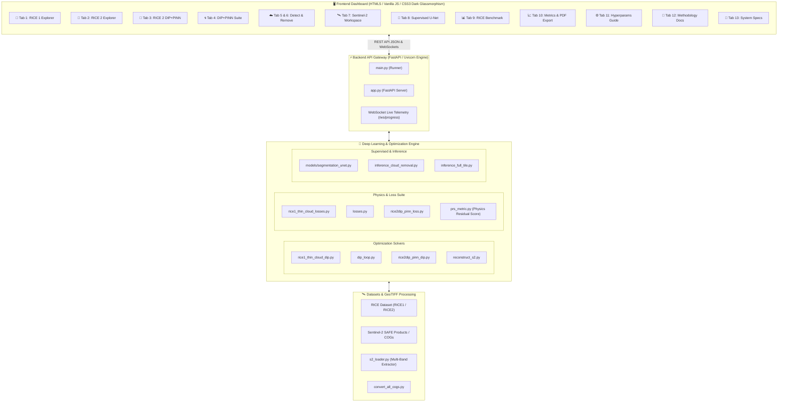
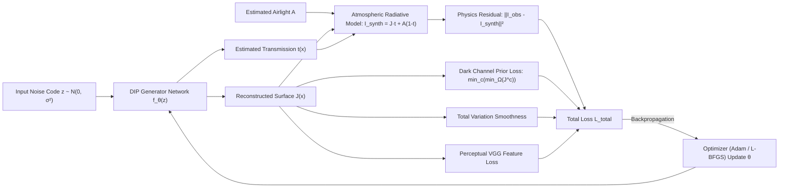
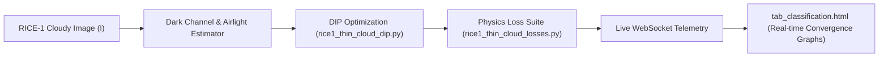
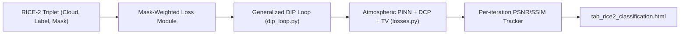
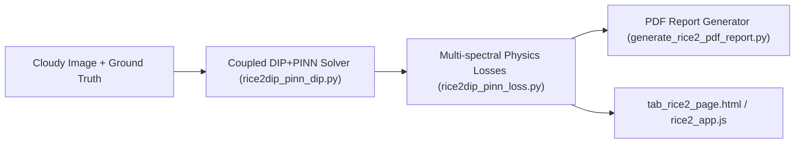
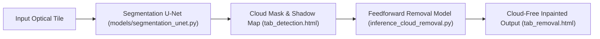
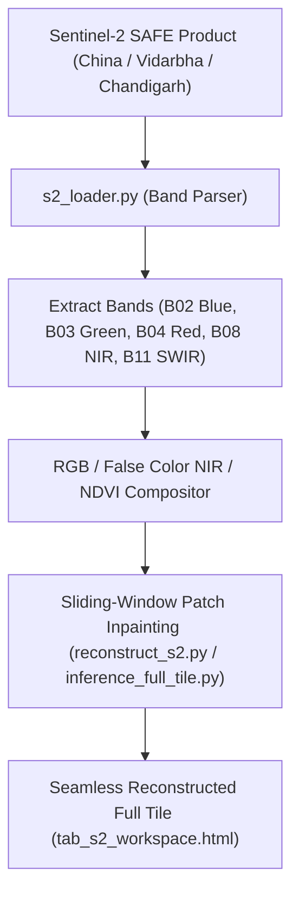
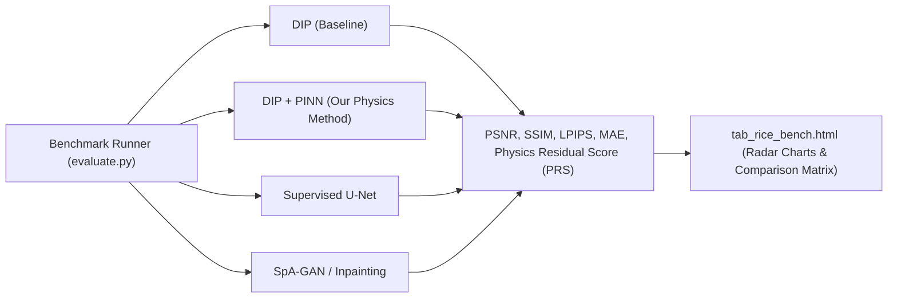

# 🛰️ Cloud Removal & Explainable AI Platform (DIP + PINN Framework)

[](https://www.python.org/)
[](https://fastapi.tiangolo.com/)
[](https://pytorch.org/)
[](#-physics-informed-atmospheric-scattering-formulation)
[](#)

A state-of-the-art research and deployment platform for **Satellite & Remote Sensing Cloud Detection, Cloud Removal, and Multi-Spectral Image Inpainting**. It couples **Deep Image Prior (DIP)** inductive bias with **Physics-Informed Neural Networks (PINN)** based on atmospheric radiative transfer models, all packaged in a modern FastAPI dashboard with **13 dedicated interactive operational tabs**.

---

## 📑 Table of Contents

1. [System Architecture & Data Flow](#-system-architecture--data-flow)
2. [Physics-Informed Atmospheric Scattering Formulation](#-physics-informed-atmospheric-scattering-formulation)
3. [Quick Start & Installation](#-quick-start--installation)
4. [Comprehensive Tab-by-Tab Breakdown (All 13 Tabs)](#-comprehensive-tab-by-tab-breakdown)
   - [Tab 1: 🧠 RICE 1 Explorer (`tab_classification.html`)](#tab-1--rice-1-explorer)
   - [Tab 2: 🧠 RICE 2 Explorer (`tab_rice2_classification.html`)](#tab-2--rice-2-explorer)
   - [Tab 3: 🌾 RICE 2 DIP+PINN Explorer (`tab_rice2_page.html`)](#tab-3--rice-2-dippinn-explorer)
   - [Tab 4: 🌀 DIP+PINN General Optimization (`tab_dippinn.html`)](#tab-4--dippinn-general-engine)
   - [Tab 5: ☁️ Cloud Detection & Masking (`tab_detection.html`)](#tab-5-️-cloud-detection--masking)
   - [Tab 6: ✨ Cloud Removal Inference (`tab_removal.html`)](#tab-6--fast-cloud-removal-inference)
   - [Tab 7: 🛰️ Sentinel-2A Satellite Workspace (`tab_s2_workspace.html`)](#tab-7-️-sentinel-2a-satellite-workspace)
   - [Tab 8: 🧬 Supervised U-Net Baseline (`tab_supervised_unet.html`)](#tab-8--supervised-u-net-baseline)
   - [Tab 9: 📊 RICE Benchmark Comparison (`tab_rice_bench.html`)](#tab-9--rice-benchmark-comparison)
   - [Tab 10: 📈 Metrics & Analytical Suite (`tab_metrics.html`)](#tab-10--metrics--analytical-suite)
   - [Tab 11: ⚙️ Hyperparameter Tuning Guide (`tab_hyperparameter_guide.html`)](#tab-11-️-hyperparameter-tuning-guide)
   - [Tab 12: 🔬 Methodology & Derivations (`tab_methodology.html`)](#tab-12--methodology--mathematical-foundations)
   - [Tab 13: 📜 System Diagnostics & Docs (`tab_system_docs.html`)](#tab-13--system-diagnostics--docs)
5. [Complete Repository Directory Structure](#-complete-repository-directory-structure)
6. [Master Quick Reference Matrix](#-master-quick-reference-matrix)
7. [REST API & WebSocket Endpoints](#-rest-api--websocket-endpoints)
8. [Authors & Citation](#-authors--citation)

---

## 🏛️ System Architecture & Data Flow



---

## 🔬 Physics-Informed Atmospheric Scattering Formulation

Cloud degradation in optical remote sensing is modeled via McCartney & Koschmieder atmospheric radiative transfer:

$$I(x) = J(x) \cdot t(x) + A(x) \cdot (1 - t(x))$$

Where:
* **$I(x)$**: Observed degraded cloudy satellite image ($H \times W \times C$).
* **$J(x)$**: Clean ground radiance (scene to recover).
* **$t(x)$**: Atmospheric transmission medium map ($t(x) \in (0, 1]$), defined as $t(x) = e^{-\beta(\lambda) d(x)}$.
* **$A(x)$**: Global/Local atmospheric airlight / cloud scattering radiance vector.

### 📐 Total Physics-Informed Optimization Loss $\mathcal{L}_{\text{total}}$

$$\mathcal{L}_{\text{total}} = \lambda_{\text{rec}} \mathcal{L}_{\text{rec}}(I, \hat{I}) + \lambda_{\text{PINN}} \mathcal{L}_{\text{PINN}} + \lambda_{\text{DCP}} \mathcal{L}_{\text{DCP}}(\hat{J}) + \lambda_{\text{TV}} \mathcal{L}_{\text{TV}}(\hat{J}, \hat{t}) + \lambda_{\text{perc}} \mathcal{L}_{\text{perc}}(\hat{J}, I)$$



---

## 🚀 Quick Start & Installation

### 1. Clone & Setup Python Virtual Environment

```powershell
# Navigate to project directory
cd c:\Users\01soj\Downloads\Pinn+dipp

# Create isolated Python virtual environment
python -m venv .venv

# Activate environment (Windows PowerShell)
.\.venv\Scripts\Activate.ps1

# Upgrade pip and install all project dependencies
pip install --upgrade pip
pip install -r requirements.txt
```

### 2. Verify GPU/CUDA Support
PyTorch will automatically detect NVIDIA GPUs with CUDA acceleration:
```powershell
python -c "import torch; print('CUDA Available:', torch.cuda.is_available(), '| Device:', torch.cuda.get_device_name(0) if torch.cuda.is_available() else 'CPU')"
```

### 3. Launch the Web Application
```powershell
python main.py
```
- 🌐 **Web Dashboard UI**: [http://127.0.0.1:8000](http://127.0.0.1:8000)
- 📚 **FastAPI Swagger Docs**: [http://127.0.0.1:8000/docs](http://127.0.0.1:8000/docs)
- 📖 **Redoc Alternative API Docs**: [http://127.0.0.1:8000/redoc](http://127.0.0.1:8000/redoc)

---

## 📑 Comprehensive Tab-by-Tab Breakdown

---

### Tab 1: 🧠 RICE 1 Explorer
> **Purpose**: Dedicated research interface for thin, semi-transparent cirrus cloud removal using the RICE-1 benchmark dataset (500 paired cloudy and cloud-free images).



* **HTML Template**: `web/templates/partials/tab_classification.html`
* **Frontend Controller**: `web/static/rice1_explorer/rice1_explorer.js`
* **Backend Engines**:
  - `rice1_thin_cloud_dip.py` — Dedicated DIP optimizer loop for thin cloud profiles.
  - `rice1_thin_cloud_losses.py` — Specialized thin-cloud transmission and DCP losses.
* **Key Features**:
  - Dropdown selector for 500 RICE-1 image pairs.
  - Live transmission map $t(x)$ rendering.
  - Real-time loss curves (MSE, DCP loss, Physics residual, TV smoothness).
  - Side-by-side Ground Truth vs. DIP Reconstructed comparison.

---

### Tab 2: 🧠 RICE 2 Explorer
> **Purpose**: Advanced laboratory for RICE-2 dataset containing 450 triplets: (1) Thick Cloud Image, (2) Ground Truth Clean Image, and (3) Precise Binary Cloud Mask.



* **HTML Template**: `web/templates/partials/tab_rice2_classification.html`
* **Frontend Controller**: `web/static/rice2_explorer/rice2_explorer.js`
* **Backend Engines**:
  - `dip_loop.py` — Deep Image Prior reconstruction engine with multi-scale skip connections.
  - `losses.py` — Core mathematical suite implementing Atmospheric Radiative Transfer, DCP, perceptual loss, and gradient priors.
* **Key Features**:
  - Interactive ablation toggles (enable/disable PINN physics, perceptual VGG, edge losses).
  - Mask-guided loss attenuation (focusing gradients inside cloud regions).
  - PSNR and SSIM progression charting per iteration.

---

### Tab 3: 🌾 RICE 2 DIP+PINN Explorer
> **Purpose**: Flagship coupled DIP+PINN solver specifically calibrated for dense cumulus cloud penetration and shadow mitigation.



* **HTML Template**: `web/templates/partials/tab_rice2_page.html`
* **Frontend Controller**: `web/static/rice2_app.js`
* **Backend Engines**:
  - `rice2dip_pinn_dip.py` — Coupled generator predicting clean radiance $J$ and physical transmission $t$ simultaneously.
  - `rice2dip_pinn_loss.py` — High-precision atmospheric physics constraints and boundary value regularizers.
  - `generate_rice2_pdf_report.py` — Direct publication-ready PDF report exporter.
* **Key Features**:
  - Fine-grained loss weighting sliders ($\lambda_{\text{PINN}}$, $\lambda_{\text{DCP}}$, $\lambda_{\text{TV}}$, $\lambda_{\text{rec}}$).
  - High-resolution comparative viewer with zoom/pan inspection.
  - One-click PDF export containing tabular metrics, radar plots, and visual panels.

---

### Tab 4: 🌀 DIP+PINN General Engine
> **Purpose**: Unsupervised zero-shot image restoration engine allowing arbitrary user image uploads or benchmark image testing.

* **HTML Template**: `web/templates/partials/tab_dippinn.html`
* **Frontend Controller**: `web/static/dippinn.js`
* **Backend Engines**: `dip_loop.py`, `losses.py`
* **Key Features**:
  - Upload custom optical/satellite imagery.
  - Configure optimizers (Adam vs. L-BFGS), learning rate schedules, and noise code distributions ($\mathcal{N}(0, \sigma^2)$ or Uniform).

---

### Tab 5 & 6: ☁️ Cloud Detection & ✨ Fast Removal Inference
> **Purpose**: Fast neural detection of cloud boundaries and rapid single-pass feedforward cloud removal.



* **HTML Templates**:
  - `web/templates/partials/tab_detection.html` (Cloud Detection & Masking)
  - `web/templates/partials/tab_removal.html` (Removal Inference)
* **Backend Engines**:
  - `models/segmentation_unet.py` — Deep convolutional cloud segmentation network.
  - `inference_cloud_removal.py` — High-throughput inference module.
  - `extract_cloud_patches.py` & `extract_real_clouds.py` — Real-world patch extraction utilities.

---

### Tab 7: 🛰️ Sentinel-2A Satellite Workspace
> **Purpose**: Enterprise remote sensing environment for loading authentic ESA Sentinel-2 L1C/L2A SAFE directory products and Cloud-Optimized GeoTIFFs (COGs).



* **HTML Template**: `web/templates/partials/tab_s2_workspace.html`
* **Frontend Controller**: `web/static/s2_workspace.js`
* **Backend Engines & Data**:
  - `s2_loader.py` — Multi-spectral band extraction and geospatial metadata parser.
  - `reconstruct_s2.py` — Patch-wise reconstruction and blending engine.
  - `convert_all_cogs.py`, `convert_chandigarh_cogs.py`, `convert_cogs.py`, `convert_to_cog.py` — COG conversion scripts.
  - **Included Datasets**: `China.SAFE`, `Vidarbha_Nagpur_Maharashtra.SAFE`, `Vidarbha_Yavatmal_Maharashtra.SAFE`, `Chandigarh_Punjab_Haryana.SAFE`.
* **Key Features**:
  - Multi-band combination viewer (True Color RGB, False Color Infrared, Agriculture, NDVI).
  - Tiled geospatial coordinate inspection and bounding-box cropping.

---

### Tab 8: 🧬 Supervised U-Net Baseline
> **Purpose**: Training, validation, and benchmarking of classical supervised convolutional neural networks.

* **HTML Template**: `web/templates/partials/tab_supervised_unet.html`
* **Frontend Controller**: `web/static/supervised_unet.js`
* **Backend Engines**:
  - `models/unet.py`, `models/segmentation_unet.py`
  - `training/train_unet.py`, `training_advanced/`
  - `evaluate.py`
* **Key Features**:
  - Supervised training loss vs. epoch curves.
  - Validation metrics (MSE, MAE, IoU, Dice Score).

---

### Tab 9: 📊 RICE Benchmark Comparison
> **Purpose**: Quantitative comparison across multiple state-of-the-art architectures.



* **HTML Template**: `web/templates/partials/tab_rice_bench.html`
* **Backend Engines**:
  - `evaluate.py` — Full benchmark orchestration script.
  - `calculate_metrics_cli.py` — Headless CLI metric engine.
  - `metrics/psnr_ssim.py`, `metrics/iou_dice.py`
* **Key Features**:
  - Interactive multi-model comparison table.
  - Visual delta difference maps and error heatmaps.

---

### Tab 10: 📈 Metrics & Analytical Suite
> **Purpose**: Deep analytical inspection of mathematical metrics, error distributions, and automated report compilation.

* **HTML Template**: `web/templates/partials/tab_metrics.html`
* **Backend Engines**:
  - `prs_metric.py` — **Physics Residual Score (PRS)** implementation.
  - `generate_report.py`, `generate_pdf_report.py` — Automated reporting scripts.
* **Key Features**:
  - Comprehensive metrics: PSNR ($dB$), SSIM ($[0,1]$), MAE, LPIPS (Perceptual Distance), PRS.
  - Export PDF research reports with single-click automation.

---

### Tab 11: ⚙️ Hyperparameter Tuning Guide
> **Purpose**: Interactive handbook and preset manager for loss weights and network configurations.

* **HTML Template**: `web/templates/partials/tab_hyperparameter_guide.html`
* **Backend Engines**:
  - `configs/` — YAML / JSON hyperparameter specifications.
  - `hyperparameter_profiles/` — Cloud-specific profiles (Cirrus, Stratus, Cumulus, Urban haze).
* **Key Features**:
  - Interactive sliders with mathematical impact explanations.
  - One-click presets: *Aggressive Cloud Penetration*, *Balanced Restoration*, *Thin Haze Defogging*.

---

### Tab 12: 🔬 Methodology & Mathematical Foundations
> **Purpose**: Theoretical documentation detailing atmospheric radiative transfer, DIP inductive biases, and optimization dynamics.

* **HTML Template**: `web/templates/partials/tab_methodology.html`
* **Core Documentation Files**:
  - `COMPLETE_PROJECT_SPECIFICATION.md`
  - `cloudvision_research_report.pdf`
* **Key Features**:
  - LaTeX equation derivations for Koschmieder atmospheric model.
  - Proofs of DIP spectral bias and regularization properties.

---

### Tab 13: 📜 System Diagnostics & Docs
> **Purpose**: Live server telemetry, hardware utilization, REST API documentation, and environment status.

* **HTML Template**: `web/templates/partials/tab_system_docs.html`
* **Backend Engines**:
  - `app.py`, `main.py`
  - `project_architecture.md`
* **Key Features**:
  - Live GPU VRAM and CPU thread monitor.
  - Active WebSocket connection status.
  - Direct links to OpenAPI documentation.

---

## 🗂️ Complete Repository Directory Structure

```text
├── main.py                               # Application entrypoint (FastAPI / Uvicorn server launcher)
├── app.py                                # Primary FastAPI application routes, endpoints & WebSocket hub
├── s2_loader.py                          # Sentinel-2 SAFE / COG multi-band reader and preprocessor
├── losses.py                             # General atmospheric physics & DIP loss suite
├── dip_loop.py                           # Multi-scale Deep Image Prior optimization loop
│
├── rice1_thin_cloud_dip.py               # RICE-1 dedicated thin cloud DIP solver
├── rice1_thin_cloud_losses.py            # RICE-1 thin cloud physics & DCP losses
│
├── rice2dip_pinn_dip.py                  # RICE-2 coupled DIP+PINN thick cloud reconstruction model
├── rice2dip_pinn_loss.py                 # RICE-2 multi-spectral physics-constrained loss functions
│
├── evaluate.py                           # Full benchmark test runner across datasets
├── prs_metric.py                         # Physics Residual Score (PRS) metric implementation
├── calculate_metrics_cli.py              # Command-line metric evaluator
├── generate_pdf_report.py                # Automated PDF report builder
├── generate_rice2_pdf_report.py          # Dedicated RICE-2 PDF experiment report builder
│
├── convert_all_cogs.py                   # Batch converter: Sentinel-2 SAFE to Cloud-Optimized GeoTIFFs
├── convert_chandigarh_cogs.py            # Chandigarh region COG generator
├── convert_cogs.py                       # General COG converter
├── convert_to_cog.py                     # Single-tile COG exporter
├── reconstruct_s2.py                     # Sentinel-2 tile inpainting and reconstruction
├── inference_cloud_removal.py            # Single-pass feedforward cloud removal inference
├── inference_full_tile.py                # Full-scene sliding window inference & blending
│
├── COMPLETE_PROJECT_SPECIFICATION.md     # In-depth architectural & theoretical documentation
├── project_architecture.md               # Backend system design specifications
├── requirements.txt                      # Python library dependencies
│
├── datasets/                             # Dataset loader modules
├── models/                               # Neural network models (U-Net, Seg-UNet, DIP Generator)
├── metrics/                              # PSNR, SSIM, IoU, Dice calculation modules
├── configs/                              # Configuration files & hyperparameter YAMLs
├── hyperparameter_profiles/              # Pre-tuned parameter presets
├── explainability/                       # Captum XAI attribution utilities
│
├── RICE_DATASET/                         # Benchmark remote sensing dataset
│   ├── RICE1/                            # 500 Thin Cloud image pairs (cloud / label)
│   └── RICE2/                            # 450 Thick Cloud triplets (cloud / label / mask)
│
├── China.SAFE/                           # Authentic Sentinel-2A SAFE product (China region)
├── Vidarbha_Nagpur_Maharashtra.SAFE/     # Sentinel-2A SAFE product (Nagpur, India)
├── Vidarbha_Yavatmal_Maharashtra.SAFE/   # Sentinel-2A SAFE product (Yavatmal, India)
├── Chandigarh_Punjab_Haryana.SAFE/       # Sentinel-2A SAFE product (Chandigarh, India)
│
└── web/                                  # Web Application frontend
    ├── static/                           # CSS styling, JavaScript controllers & assets
    │   ├── css/                          # Modern glassmorphic stylesheets
    │   ├── rice1_explorer/               # RICE 1 Explorer JS logic
    │   ├── rice2_explorer/               # RICE 2 Explorer JS logic
    │   └── rice2_app.js                  # RICE 2 DIP+PINN application controller
    └── templates/
        ├── index.html                    # Main master dashboard container
        └── partials/                     # 13 Dedicated Sub-Tab HTML templates
            ├── tab_classification.html   # 🧠 Tab 1: RICE 1 Explorer
            ├── tab_rice2_classification.html # 🧠 Tab 2: RICE 2 Explorer
            ├── tab_rice2_page.html       # 🌾 Tab 3: RICE 2 DIP+PINN Explorer
            ├── tab_dippinn.html          # 🌀 Tab 4: DIP+PINN General Suite
            ├── tab_detection.html        # ☁️ Tab 5: Cloud Detection & Masking
            ├── tab_removal.html          # ✨ Tab 6: Cloud Removal Inference
            ├── tab_s2_workspace.html     # 🛰️ Tab 7: Sentinel-2A Satellite Workspace
            ├── tab_supervised_unet.html  # 🧬 Tab 8: Supervised U-Net Baseline
            ├── tab_rice_bench.html       # 📊 Tab 9: RICE Benchmark Comparison
            ├── tab_metrics.html          # 📈 Tab 10: Metrics & Analytical Suite
            ├── tab_hyperparameter_guide.html # ⚙️ Tab 11: Hyperparameter Guide
            ├── tab_methodology.html      # 🔬 Tab 12: Methodology & Equations
            └── tab_system_docs.html      # 📜 Tab 13: System Diagnostics & Docs
```

---

## 📊 Master Quick Reference Matrix

| # | Tab Title | HTML Template (`web/templates/partials/`) | Core Backend / Python Engine | Primary Frontend JS (`web/static/`) | Primary Output / Goal |
|---|:---|:---|:---|:---|:---|
| **1** | **🧠 RICE 1 Explorer** | `tab_classification.html` | `rice1_thin_cloud_dip.py`, `rice1_thin_cloud_losses.py` | `rice1_explorer/rice1_explorer.js` | Thin cloud defogging & $t(x)$ estimation |
| **2** | **🧠 RICE 2 Explorer** | `tab_rice2_classification.html` | `dip_loop.py`, `losses.py` | `rice2_explorer/rice2_explorer.js` | Thick cloud DIP ablation & live metrics |
| **3** | **🌾 RICE 2 DIP+PINN** | `tab_rice2_page.html` | `rice2dip_pinn_dip.py`, `rice2dip_pinn_loss.py` | `rice2_app.js` | Coupled DIP+PINN & PDF reporting |
| **4** | **🌀 DIP+PINN Engine** | `tab_dippinn.html` | `dip_loop.py`, `losses.py` | `dippinn.js` | Unsupervised zero-shot custom restoration |
| **5** | **☁️ Cloud Detection** | `tab_detection.html` | `models/segmentation_unet.py` | `detection.js` | Cloud & shadow semantic segmentation |
| **6** | **✨ Cloud Removal** | `tab_removal.html` | `inference_cloud_removal.py` | `removal.js` | Fast single-pass neural inpainting |
| **7** | **🛰️ Sentinel-2A** | `tab_s2_workspace.html` | `s2_loader.py`, `reconstruct_s2.py` | `s2_workspace.js` | Multi-spectral SAFE/COG full-tile processing |
| **8** | **🧬 Supervised U-Net** | `tab_supervised_unet.html` | `models/unet.py`, `training/train_unet.py` | `supervised_unet.js` | Supervised baseline comparison |
| **9** | **📊 RICE Benchmark** | `tab_rice_bench.html` | `evaluate.py`, `calculate_metrics_cli.py` | `rice_bench.js` | Model comparison radar & tables |
| **10** | **📈 Metrics Suite** | `tab_metrics.html` | `prs_metric.py`, `generate_pdf_report.py` | `metrics.js` | PSNR, SSIM, PRS analysis & PDF export |
| **11** | **⚙️ Hyperparameters** | `tab_hyperparameter_guide.html` | `configs/`, `hyperparameter_profiles/` | Inline slider controls | Interactive loss tuning handbook |
| **12** | **🔬 Methodology** | `tab_methodology.html` | `COMPLETE_PROJECT_SPECIFICATION.md` | Inline documentation | Atmospheric radiative transfer physics |
| **13** | **📜 System Docs** | `tab_system_docs.html` | `app.py`, `main.py` | Inline telemetry | GPU/CPU monitors & API specs |

---

## 🌐 REST API & WebSocket Endpoints

| Method | Endpoint | Description |
|---|---|---|
| `GET` | `/` | Serves master HTML dashboard |
| `GET` | `/api/rice1/samples` | Lists available RICE-1 cloudy & ground-truth image pairs |
| `POST` | `/api/rice1/run_dip` | Triggers thin-cloud DIP optimization loop |
| `GET` | `/api/rice2/samples` | Lists RICE-2 triplets (cloudy image, ground truth, cloud mask) |
| `POST` | `/api/rice2/run_optimization` | Launches coupled RICE-2 DIP+PINN solver |
| `POST` | `/api/s2/load_tile` | Reads Sentinel-2 SAFE / COG multi-band arrays |
| `POST` | `/api/s2/reconstruct` | Executes sliding-window reconstruction on satellite tiles |
| `GET` | `/api/metrics/summary` | Returns quantitative benchmark scores (PSNR, SSIM, PRS) |
| `POST` | `/api/reports/generate_pdf` | Builds and downloads full scientific PDF evaluation report |
| `WS` | `/ws/progress` | Live WebSocket streaming per-iteration loss & PSNR/SSIM telemetry |

---

## 👥 Authors & Acknowledgments

* **Project**: Cloud Removal via Coupled Deep Image Prior & Physics-Informed Neural Networks (DIP+PINN)
* **Datasets**: RICE (Remote Sensing Image Cloud Removal Dataset), European Space Agency (ESA) Copernicus Sentinel-2
* **Frameworks**: PyTorch, FastAPI, Rasterio, OpenCV, NumPy, SciPy, Chart.js
