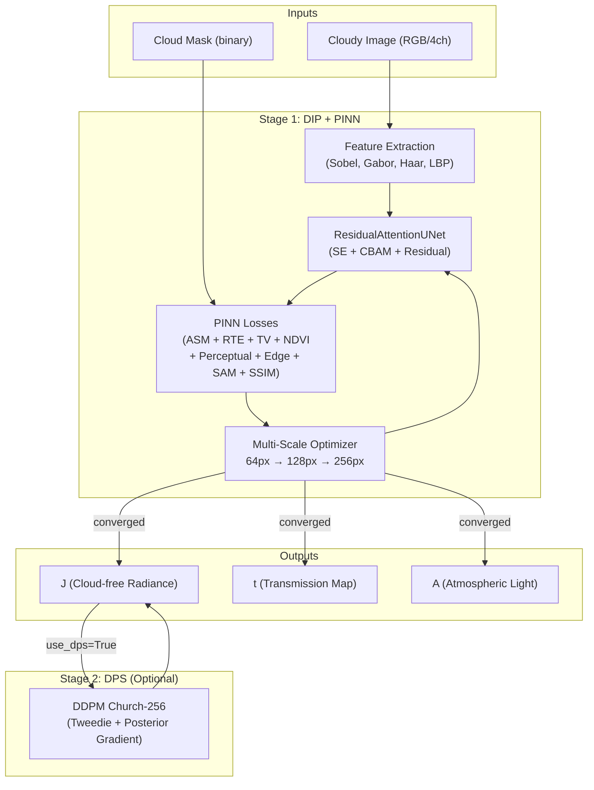
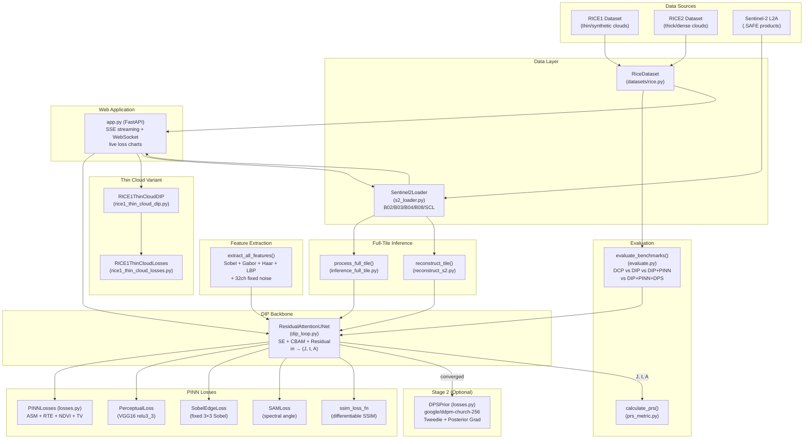
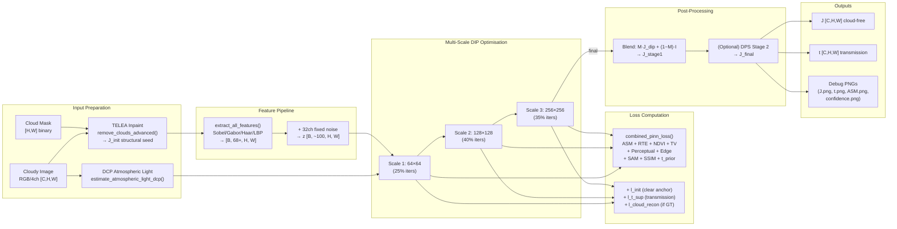
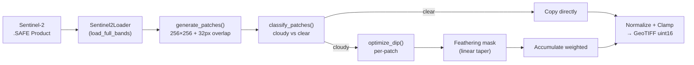
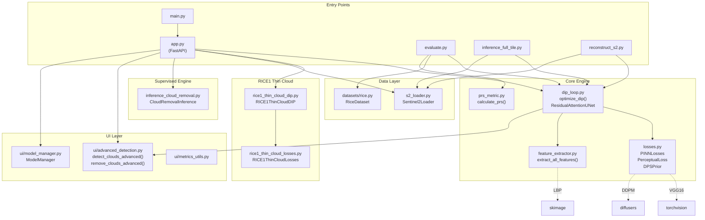
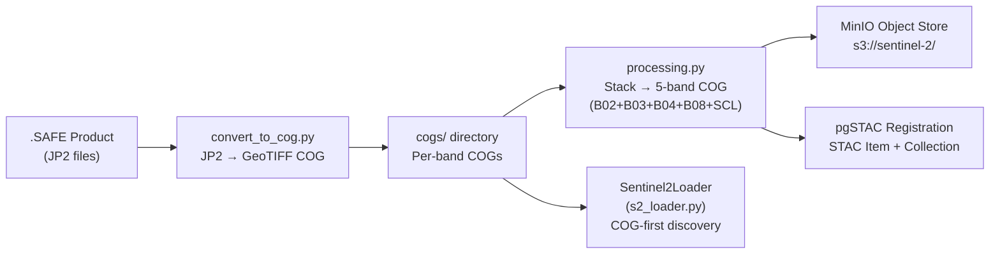

# 🧠 RICE 2 DIP+PINN Explorer Tab — Complete File & Code Map

> **Scope**: This document covers the **DIP+PINN zero-shot cloud removal engine** — the Deep Image Prior backbone, Physics-Informed Neural Network losses, the DPS diffusion prior (Stage 2), the Sentinel-2 data loader, feature extraction, full-tile inference, the RICE1 thin-cloud variant, evaluation/benchmarking, COG processing, PDF reporting, and the web application endpoints that expose the DIP+PINN pipeline. It is intentionally separated from the RICE2 supervised models (U-Net segmentation, CloudRemovalUNet).

---

## 📑 Table of Contents

1. [What Is DIP+PINN?](#1-what-is-dippinn)
2. [System Overview & Two-Stage Pipeline](#2-system-overview--two-stage-pipeline)
3. [Complete File Map](#3-complete-file-map)
4. [Architecture Diagram](#4-architecture-diagram)
5. [Data Flow Diagram](#5-data-flow-diagram)
6. [Class & Function Reference](#6-class--function-reference)
7. [Model Architecture Reference](#7-model-architecture-reference)
8. [Loss Function Reference](#8-loss-function-reference)
9. [Feature Extractor Reference](#9-feature-extractor-reference)
10. [Sentinel-2 Data Loader Reference](#10-sentinel-2-data-loader-reference)
11. [RICE1 Thin Cloud Variant](#11-rice1-thin-cloud-variant)
12. [Inference & Full-Tile Pipeline](#12-inference--full-tile-pipeline)
13. [Evaluation & Benchmark Reference](#13-evaluation--benchmark-reference)
14. [Metrics Reference](#14-metrics-reference)
15. [Configuration & Hyperparameters](#15-configuration--hyperparameters)
16. [Dependency Graph](#16-dependency-graph)
17. [Key API Endpoints (DIP+PINN)](#17-key-api-endpoints-dippinn)
18. [Utility & Report Scripts](#18-utility--report-scripts)
19. [COG Processing Pipeline](#19-cog-processing-pipeline)

---

## 1. What Is DIP+PINN?

| Property | Value |
|:---|:---|
| **Full Name** | Deep Image Prior + Physics-Informed Neural Network |
| **Paradigm** | Zero-shot / unsupervised — **no training data required** |
| **Input** | Single cloudy image (RGB or 4-ch multispectral) + binary cloud mask |
| **Physics Model** | Atmospheric Scattering Model (ASM): `I = J·t + A·(1 − t)` |
| **Backbone** | `ResidualAttentionUNet` (SE + CBAM spatial attention + residual conv blocks) |
| **Feature Input** | Handcrafted 68+ channel feature map (Sobel, Gabor, Haar wavelets, LBP) + 32ch noise |
| **Optimization** | Multi-scale progressive (64px → 128px → 256px), Adam + CosineAnnealingLR |
| **Stage 2 (Optional)** | DPS — Diffusion Posterior Sampling using `google/ddpm-church-256` |
| **Outputs** | `J` (cloud-free radiance), `t` (transmission map), `A` (atmospheric light) |
| **Supported Data** | RICE1 (thin), RICE2 (thick), Sentinel-2 L2A (real-world 4-band) |

> [!IMPORTANT]
> Unlike the supervised RICE2 U-Net pipeline, the DIP+PINN engine operates at **test time** — it optimizes a randomly-initialised network on each individual image. No pre-training, no learned weights. Physics equations are the supervisory signal.

---

## 2. System Overview & Two-Stage Pipeline



> [!TIP]
> Stage 1 takes ~60–120 seconds (2000 iterations on GPU). Stage 2 DPS adds ~10–30 seconds. CPU is ~5–10× slower.

---

## 3. Complete File Map

### 3.1 Core DIP+PINN Engine

| File | Purpose | Key Classes / Functions |
|:---|:---|:---|
| [`dip_loop.py`](file:///c:/Users/01soj/Downloads/Pinn+dipp/dip_loop.py) | Main DIP+PINN optimization engine | `optimize_dip()`, `_run_scale()`, `ResidualAttentionUNet`, `estimate_atmospheric_light_dcp()` |
| [`losses.py`](file:///c:/Users/01soj/Downloads/Pinn+dipp/losses.py) | All physics + perceptual losses | `PINNLosses`, `PerceptualLoss`, `SobelEdgeLoss`, `SAMLoss`, `CharbonnierLoss`, `DPSPrior`, `ssim_loss_fn()` |
| [`feature_extractor.py`](file:///c:/Users/01soj/Downloads/Pinn+dipp/feature_extractor.py) | Multi-domain feature extraction | `extract_all_features()`, `extract_edges()`, `extract_gabor()`, `extract_wavelets()`, `extract_fft()`, `extract_lbp()` |
| [`prs_metric.py`](file:///c:/Users/01soj/Downloads/Pinn+dipp/prs_metric.py) | Physical Realism Score (no-reference) | `calculate_prs()`, `calculate_sam()` |

### 3.2 RICE1 Thin Cloud Variant

| File | Purpose | Key Classes / Functions |
|:---|:---|:---|
| [`rice1_thin_cloud_dip.py`](file:///c:/Users/01soj/Downloads/Pinn+dipp/rice1_thin_cloud_dip.py) | Thin-cloud DIP optimizer (RICE1-specific) | `RICE1ThinCloudDIP`, `optimize_rice1_thin_cloud()`, `optimize_rice1_thin_cloud_api()` |
| [`rice1_thin_cloud_losses.py`](file:///c:/Users/01soj/Downloads/Pinn+dipp/rice1_thin_cloud_losses.py) | Thin-cloud PINN losses | `RICE1ThinCloudLosses` |

### 3.3 Sentinel-2 Data Layer

| File | Purpose | Key Classes / Functions |
|:---|:---|:---|
| [`s2_loader.py`](file:///c:/Users/01soj/Downloads/Pinn+dipp/s2_loader.py) | Sentinel-2 L2A band/SCL loader | `Sentinel2Loader` |
| [`processing.py`](file:///c:/Users/01soj/Downloads/Pinn+dipp/processing.py) | COG stacking + MinIO + pgSTAC ingestion | `create_stacked_cog()`, `init_minio()`, `ingest_to_pgstac()` |
| [`convert_to_cog.py`](file:///c:/Users/01soj/Downloads/Pinn+dipp/convert_to_cog.py) | JP2 → Cloud Optimized GeoTIFF converter | `convert_band_to_cog()`, `find_band_jp2()` |
| [`convert_cogs.py`](file:///c:/Users/01soj/Downloads/Pinn+dipp/convert_cogs.py) | Batch COG conversion for one product | — |
| [`convert_all_cogs.py`](file:///c:/Users/01soj/Downloads/Pinn+dipp/convert_all_cogs.py) | Batch COG conversion for all products | — |
| [`convert_chandigarh_cogs.py`](file:///c:/Users/01soj/Downloads/Pinn+dipp/convert_chandigarh_cogs.py) | Chandigarh-specific COG conversion | — |
| [`generate_overviews.py`](file:///c:/Users/01soj/Downloads/Pinn+dipp/generate_overviews.py) | GDAL overview generation for TCI | — |

### 3.4 Full-Tile Inference & Reconstruction

| File | Purpose | Key Classes / Functions |
|:---|:---|:---|
| [`inference_full_tile.py`](file:///c:/Users/01soj/Downloads/Pinn+dipp/inference_full_tile.py) | Patch-based Sentinel-2 full-tile reconstruction | `process_full_tile()`, `get_feather_mask()` |
| [`reconstruct_s2.py`](file:///c:/Users/01soj/Downloads/Pinn+dipp/reconstruct_s2.py) | Alternative tile reconstruction with blending | `reconstruct_tile()`, `generate_blending_window()` |

### 3.5 Cloud Extraction Utilities

| File | Purpose | Key Functions |
|:---|:---|:---|
| [`extract_cloud_patches.py`](file:///c:/Users/01soj/Downloads/Pinn+dipp/extract_cloud_patches.py) | Extracts SCL-classified cloud patches | `extract_patches()` |
| [`extract_real_clouds.py`](file:///c:/Users/01soj/Downloads/Pinn+dipp/extract_real_clouds.py) | Extracts real-cloud RGB patches from COGs | `extract_real_clouds()` |

### 3.6 Evaluation & Benchmarking

| File | Purpose | Key Functions |
|:---|:---|:---|
| [`evaluate.py`](file:///c:/Users/01soj/Downloads/Pinn+dipp/evaluate.py) | Multi-variant benchmark (DCP vs DIP vs DIP+PINN vs DIP+PINN+DPS) | `evaluate_benchmarks()`, `run_dcp_baseline()` |
| [`calculate_metrics_cli.py`](file:///c:/Users/01soj/Downloads/Pinn+dipp/calculate_metrics_cli.py) | CLI for computing metrics on saved outputs | — |

### 3.7 Hyperparameter Profiles

| Directory / File | Purpose |
|:---|:---|
| [`hyperparameter_profiles/RICE1/`](file:///c:/Users/01soj/Downloads/Pinn+dipp/hyperparameter_profiles/RICE1) | Per-sample optimal hyperparameter JSON profiles for RICE1 thin cloud |
| [`hyperparameter_profiles/RICE2/`](file:///c:/Users/01soj/Downloads/Pinn+dipp/hyperparameter_profiles/RICE2) | Per-sample optimal hyperparameter JSON profiles for RICE2 thick cloud |
| [`hyperparameter_profiles/MASTER_HYPERPARAMETER_GUIDE.md`](file:///c:/Users/01soj/Downloads/Pinn+dipp/hyperparameter_profiles/MASTER_HYPERPARAMETER_GUIDE.md) | Master guide for hyperparameter tuning |

### 3.8 Scripts & Utilities

| File | Purpose |
|:---|:---|
| [`scripts/calculate_optimal_hyperparameters.py`](file:///c:/Users/01soj/Downloads/Pinn+dipp/scripts/calculate_optimal_hyperparameters.py) | Computes per-sample physical hyperparameters for RICE1 & RICE2 (DCP, scattering, transmission analysis) |
| [`scripts/synthetic_experiment.py`](file:///c:/Users/01soj/Downloads/Pinn+dipp/scripts/synthetic_experiment.py) | Runs DIP+PINN on synthetic obstacles (mesh, shapes, cloud) for controlled testing |
| [`scripts/generate_docx_article.py`](file:///c:/Users/01soj/Downloads/Pinn+dipp/scripts/generate_docx_article.py) | Generates research article DOCX with results |
| [`scripts/inspect_dataset.py`](file:///c:/Users/01soj/Downloads/Pinn+dipp/scripts/inspect_dataset.py) | Prints dataset statistics for RICE1/RICE2 |

### 3.9 Report Generation

| File | Purpose | Key Functions |
|:---|:---|:---|
| [`generate_pdf_report.py`](file:///c:/Users/01soj/Downloads/Pinn+dipp/generate_pdf_report.py) | ReportLab-based PDF with CloudVision results | `build_pdf()`, `generate_pdf_report()`, `NumberedCanvas` |
| [`generate_report.py`](file:///c:/Users/01soj/Downloads/Pinn+dipp/generate_report.py) | LaTeX `.tex` project file listing | `generate_tex()` |

### 3.10 Web Application (DIP+PINN endpoints)

| File | Purpose |
|:---|:---|
| [`app.py`](file:///c:/Users/01soj/Downloads/Pinn+dipp/app.py) | FastAPI server — DIP+PINN optimisation, S2 tile browser, SSE streaming, WebSocket live updates |
| [`main.py`](file:///c:/Users/01soj/Downloads/Pinn+dipp/main.py) | Entry point — launches `uvicorn` on `app:app` |
| [`web/templates/index.html`](file:///c:/Users/01soj/Downloads/Pinn+dipp/web/templates/index.html) | Frontend HTML — DIP+PINN tab, S2 explorer, RICE gallery |
| [`web/static/app.js`](file:///c:/Users/01soj/Downloads/Pinn+dipp/web/static/app.js) | JS logic — SSE streaming, live loss charts, map interaction |
| [`web/static/styles.css`](file:///c:/Users/01soj/Downloads/Pinn+dipp/web/static/styles.css) | Glassmorphic dark-mode CSS |

### 3.11 Detection & Model Manager (shared with RICE2)

| File | Purpose | Key Functions |
|:---|:---|:---|
| [`ui/advanced_detection.py`](file:///c:/Users/01soj/Downloads/Pinn+dipp/ui/advanced_detection.py) | Heuristic cloud detection + TELEA inpainting | `detect_clouds_advanced()`, `remove_clouds_advanced()` |
| [`ui/model_manager.py`](file:///c:/Users/01soj/Downloads/Pinn+dipp/ui/model_manager.py) | U-Net segmentation model wrapper | `ModelManager` |
| [`ui/metrics_utils.py`](file:///c:/Users/01soj/Downloads/Pinn+dipp/ui/metrics_utils.py) | Image quality metrics | `psnr()`, `ssim()`, `dice()`, `iou()` |

### 3.12 Dataset Loaders (shared with RICE2)

| File | Purpose | Key Classes |
|:---|:---|:---|
| [`datasets/rice.py`](file:///c:/Users/01soj/Downloads/Pinn+dipp/datasets/rice.py) | General RICE dataset (RICE1 + RICE2) PyTorch `Dataset` | `RiceDataset`, `RiceSample` |
| [`datasets/cloud_removal_dataset.py`](file:///c:/Users/01soj/Downloads/Pinn+dipp/datasets/cloud_removal_dataset.py) | RICE-II 4-channel loader for supervised training | `CloudRemovalDataset` |
| [`datasets.py`](file:///c:/Users/01soj/Downloads/Pinn+dipp/datasets.py) | Root forwarding module | `from datasets.rice import RICEDataset` |

### 3.13 Source Code Archive

| Directory | Purpose |
|:---|:---|
| [`source_code_extracted/`](file:///c:/Users/01soj/Downloads/Pinn+dipp/source_code_extracted) | Previous versions of core files (`app.py`, `dip_loop_old.py`, `losses_old.py`, `processing.py`, `s2_loader.py`) |

### 3.14 Configuration

| File | Purpose |
|:---|:---|
| [`configs/default.yaml`](file:///c:/Users/01soj/Downloads/Pinn+dipp/configs/default.yaml) | Global settings: `dataset_root`, `image_size: 256`, `batch_size: 4`, `lr: 0.0001` |
| [`requirements.txt`](file:///c:/Users/01soj/Downloads/Pinn+dipp/requirements.txt) | Python dependencies |

### 3.15 Sentinel-2 .SAFE Products

| Directory | Region |
|:---|:---|
| [`Vidarbha_Nagpur_Maharashtra.SAFE`](file:///c:/Users/01soj/Downloads/Pinn+dipp/Vidarbha_Nagpur_Maharashtra.SAFE) | Vidarbha (Nagpur), Maharashtra, India |
| [`Vidarbha_Yavatmal_Maharashtra.SAFE`](file:///c:/Users/01soj/Downloads/Pinn+dipp/Vidarbha_Yavatmal_Maharashtra.SAFE) | Vidarbha (Yavatmal), Maharashtra, India |
| [`China.SAFE`](file:///c:/Users/01soj/Downloads/Pinn+dipp/China.SAFE) | China |
| [`Chandigarh_Punjab_Haryana.SAFE`](file:///c:/Users/01soj/Downloads/Pinn+dipp/Chandigarh_Punjab_Haryana.SAFE) | Chandigarh / Punjab / Haryana, India |

---

## 4. Architecture Diagram



---

## 5. Data Flow Diagram



---

## 6. Class & Function Reference

### 6.1 `ResidualAttentionUNet` — [`dip_loop.py`](file:///c:/Users/01soj/Downloads/Pinn+dipp/dip_loop.py#L88-L208)

```python
class ResidualAttentionUNet(nn.Module):
    def __init__(self, in_channels=4, out_channels=4, init_A=None)
    def forward(self, x) → (J, t, A)
        # J: [B, C, H, W] Sigmoid-bounded scene radiance
        # t: [B, C, H, W] transmission in [0.05, 0.95]
        # A: [B, C, 1, 1] learned atmospheric light (Sigmoid parameterised)
```

| Component | Architecture |
|:---|:---|
| **Encoder Stage 1** | `Conv2d(in, 64)` → `InstanceNorm` → `LeakyReLU` → `_ResBlock(64)` → `_SEBlock(64)` |
| **Encoder Stage 2** | `MaxPool2d(2)` → `Conv2d(64, 128)` → `_ResBlock(128)` → `_SEBlock(128)` |
| **Bottleneck** | `MaxPool2d(2)` → `Conv2d(128, 256)` → `_ResBlock(256)` → `_SpatialAttention(k=7)` |
| **Decoder Stage 2** | `Upsample(2)` → `Conv2d(256, 128)` → `cat(skip₂)` → `Conv2d(256, 128)` → `_ResBlock(128)` |
| **Decoder Stage 1** | `Upsample(2)` → `Conv2d(128, 64)` → `cat(skip₁)` → `Conv2d(128, 64)` → `_ResBlock(64)` |
| **J Head** | `Conv2d(64, C, 1)` → `Sigmoid` |
| **t Head** | `Conv2d(64, 1, 1)` → `Sigmoid` → scale to `[0.05, 0.95]` → expand to C channels |
| **A Head** | `nn.Parameter` → `Sigmoid` (learnable per-channel atmospheric light) |

#### Internal Attention Modules

| Block | Class | Description |
|:---|:---|:---|
| **SE Block** | [`_SEBlock`](file:///c:/Users/01soj/Downloads/Pinn+dipp/dip_loop.py#L37-L53) | Squeeze-and-Excitation channel attention (AdaptiveAvgPool → FC → Sigmoid gate) |
| **Residual Block** | [`_ResBlock`](file:///c:/Users/01soj/Downloads/Pinn+dipp/dip_loop.py#L56-L71) | Two 3×3 convs + InstanceNorm + LeakyReLU + SE + skip connection |
| **Spatial Attention** | [`_SpatialAttention`](file:///c:/Users/01soj/Downloads/Pinn+dipp/dip_loop.py#L74-L85) | CBAM-style: avg+max pool → 7×7 conv → Sigmoid spatial gate |

### 6.2 `optimize_dip()` — [`dip_loop.py`](file:///c:/Users/01soj/Downloads/Pinn+dipp/dip_loop.py#L473-L800)

```python
def optimize_dip(
    cloudy_image_tensor,   # [C, H, W] reflectance [0, 1]
    mask_tensor=None,      # [H, W] cloud mask (1=cloud)
    gt_image_tensor=None,  # [C, H, W] optional GT for diagnostics
    num_iters=2000,
    lr=0.005,
    use_gpu=True,
    use_dps=False,
    dps_weight=0.5,
    callback=None,         # SSE streaming callback
    s2_loader=None,
    lambda_asm=0.0, lambda_rte=0.1, lambda_ndvi=0.05,
    lambda_tv=1e-5, lambda_perceptual=0.05, lambda_edge=0.02,
    lambda_sam=0.02, lambda_t_prior=1.0, lambda_ssim=0.1,
    alpha=1.3, edge_weight=10.0,
    ...
) → (J_tensor[C,H,W], t_tensor[C,H,W])
```

**Pipeline Steps:**
1. Estimate atmospheric light via Dark Channel Prior
2. Create structural seed via TELEA inpainting (`remove_clouds_advanced()`)
3. Extract features: `extract_all_features()` + 32ch noise injection
4. Build model: `ResidualAttentionUNet(in=~100ch, out=C)`
5. Multi-scale progressive loop: `_run_scale()` at 64px, 128px, 256px
6. Final full-res inference
7. (Optional) Stage 2: DPS sampling
8. Save debug PNGs to `outputs/debug/`

### 6.3 `_run_scale()` — [`dip_loop.py`](file:///c:/Users/01soj/Downloads/Pinn+dipp/dip_loop.py#L214-L468)

```python
def _run_scale(model, optimizer, scheduler, z, I_target, M_target, J_init_target,
               num_iters, pinn_losses, perceptual_fn, edge_fn, sam_fn,
               has_nir, scale_name, gt_target=None, callback=None,
               lambda_asm=0.0, ...) → None
```

**Per-Step Computation:**
1. `model(z)` → `(J, t, A)`
2. `combined_pinn_loss()` → physics loss dict
3. Clear-region anchor: `l_init_clear` (constant weight)
4. Cloud-region TELEA anchor: decays over first 100 steps (`w_telea`)
5. Transmission supervision: `l_t_sup` (brightness-adaptive targets)
6. Gradient clip to `max_norm=1.0`
7. Cosine LR decay

### 6.4 `PINNLosses` — [`losses.py`](file:///c:/Users/01soj/Downloads/Pinn+dipp/losses.py#L221-L514)

```python
class PINNLosses:
    def asm_loss(I, J, t, A, M=None)     → tensor  # Atmospheric Scattering Model
    def masked_recon_loss(I, J, t, A, M)  → tensor  # Clear-pixel reconstruction
    def rte_loss(t, alpha, lambdas, beta) → tensor  # Radiative Transfer Equation
    def ndvi_consistency_loss(J, I_ref, M) → tensor  # NDVI vegetation index
    def tv_loss(t, I, edge_weight)        → tensor  # Edge-aware Total Variation
    def combined_pinn_loss(I, J, t, A, M, GT, ...) → dict  # Master loss aggregator
```

### 6.5 `PerceptualLoss` — [`losses.py`](file:///c:/Users/01soj/Downloads/Pinn+dipp/losses.py#L10-L83)

```python
class PerceptualLoss(nn.Module):
    def __init__(self, device="cpu")
    # VGG16 features up to relu3_3 (layer 16), frozen weights
    # Class-level cache: VGG loaded once per process
    def forward(pred, target) → scalar  # MSE of VGG features
```

### 6.6 `DPSPrior` — [`losses.py`](file:///c:/Users/01soj/Downloads/Pinn+dipp/losses.py#L520-L638)

```python
class DPSPrior:
    def __init__(model_id="google/ddpm-church-256", device="cuda")
    def compute_loss(J) → scalar        # Legacy SDS loss
    def sample_dps(J_dip, M, num_steps=20, zeta=0.5, eta=0.0) → tensor
        # Tweedie clean estimate x̂₀
        # Posterior gradient on clear-pixel measurement consistency
        # Gaussian mask blending to prevent seams
```

### 6.7 `Sentinel2Loader` — [`s2_loader.py`](file:///c:/Users/01soj/Downloads/Pinn+dipp/s2_loader.py#L10-L520)

```python
class Sentinel2Loader:
    def __init__(self, product_dir: str)
    def _find_band_paths() → dict[str, Path]   # Auto-discovers B02/B03/B04/B08/TCI/SCL
    def get_metadata() → dict                   # CRS, transform, resolution from B02
    def load_full_bands() → (bands_4ch, cloud_mask, meta)  # Full tile [4, H, W] + SCL mask
    def load_crop(col, row, w, h, mask_source) → (bands, mask)  # Windowed read
    def load_crop_downsampled(col, row, w, h, out_w, out_h) → (bands, mask)
    def get_ui_overview(max_dim=1024) → (tci_rgb, mask)    # Fast downsampled preview
    def generate_patches(H, W, patch_size, overlap) → list[dict]
    def classify_patches(cloud_mask, patches, threshold) → (cloudy, clear)
```

### 6.8 `RICE1ThinCloudDIP` — [`rice1_thin_cloud_dip.py`](file:///c:/Users/01soj/Downloads/Pinn+dipp/rice1_thin_cloud_dip.py#L34-L97)

```python
class RICE1ThinCloudDIP(nn.Module):
    def __init__(self, channels=3, init_A=None)
    # Lighter architecture: 2 encoder stages (64, 128), no SE/CBAM
    # Direct cloudy image as input (not feature-extracted)
    def forward(x) → (J, t, A)
```

### 6.9 `calculate_prs()` — [`prs_metric.py`](file:///c:/Users/01soj/Downloads/Pinn+dipp/prs_metric.py#L31-L103)

```python
def calculate_prs(I, J, t, A, has_nir=False) → dict:
    # PRS = 1.0×ASM_residual + 0.5×SAM + 0.2×NDVI_smoothness
    # Returns: {"PRS": float, "components": {"ASM_Residual":..., "SAM":..., "NDVI_Smoothness":...}}
```

---

## 7. Model Architecture Reference

### ResidualAttentionUNet (DIP Backbone — Thick Cloud)

```
Input: z [B, ~100, 256, 256]  (feature map + 32ch noise)
  ↓
Encoder Stage 1: Conv(~100→64) → ResBlock(64) → SE(64)          ← skip₁ [B, 64, 256, 256]
  MaxPool2d(2)
Encoder Stage 2: Conv(64→128) → ResBlock(128) → SE(128)         ← skip₂ [B, 128, 128, 128]
  MaxPool2d(2)
  ↓
Bottleneck: Conv(128→256) → ResBlock(256) → SpatialAttn(7×7)    [B, 256, 64, 64]
  ↓
Decoder Stage 2: Upsample(2) → Conv(256→128) + cat(skip₂)
                 → Conv(256→128) → ResBlock(128)                 [B, 128, 128, 128]
Decoder Stage 1: Upsample(2) → Conv(128→64) + cat(skip₁)
                 → Conv(128→64) → ResBlock(64)                   [B, 64, 256, 256]
  ↓
J Head: Conv(64→C, k=1) → Sigmoid                                [B, C, 256, 256]
t Head: Conv(64→1, k=1) → Sigmoid → scale [0.05, 0.95]          [B, 1, 256, 256] → expand
A Head: nn.Parameter → Sigmoid                                    [1, C, 1, 1]
  ↓
Output: (J, t, A)
```

### RICE1ThinCloudDIP (Thin Cloud — Lighter Architecture)

```
Input: I [B, 3, 256, 256]  (cloudy image directly, with noise injection)
  ↓
Encoder 1: Conv(3→64) → InstanceNorm → LeakyReLU                 ← skip₁ [B, 64, 256, 256]
Encoder 2: MaxPool(2) → Conv(64→128) → InstanceNorm → LeakyReLU  [B, 128, 128, 128]
  ↓
Decoder 1: Upsample(2) → Conv(128→64)                            [B, 64, 256, 256]
Decoder 2: cat(skip₁) → Conv(128→64) → InstanceNorm → LeakyReLU  [B, 64, 256, 256]
  ↓
J Head: Conv(64→3, k=1) → Sigmoid
t Head: Conv(64→1, k=1) → Sigmoid → [0.05, 0.95] → expand
A Head: nn.Parameter → Sigmoid
```

> [!NOTE]
> The thin cloud variant uses the **cloudy image itself** as input (with added noise `σ=0.015`), while the thick cloud variant uses a **multi-domain feature map** (Sobel + Gabor + Haar + LBP + noise). This is because thin clouds preserve ground detail and the image itself is a good structural prior, while thick clouds require richer feature representations.

---

## 8. Loss Function Reference

### 8.1 Combined PINN Loss — [`losses.py`](file:///c:/Users/01soj/Downloads/Pinn+dipp/losses.py#L366-L514)

```
total_loss = recon_weight × l_recon
           + λ_asm × l_asm       (ramped 0 → λ over 300 steps)
           + λ_rte × l_rte       (ramped 0 → λ over 300 steps)
           + λ_tv  × l_tv
           + λ_ndvi × l_ndvi
           + λ_perceptual × l_perceptual
           + λ_edge × l_edge
           + λ_sam × l_sam
           + λ_t_prior × l_t_prior  (active after step 50)
           + λ_ssim × l_ssim
```

### 8.2 Individual Loss Components

| Loss | Class/Function | Formula / Description |
|:---|:---|:---|
| **ASM** | `PINNLosses.asm_loss()` | `MSE(J·t + A·(1−t), I)` — only on clear pixels |
| **RTE** | `PINNLosses.rte_loss()` | Radiative Transfer: Rayleigh (`λ^-4`) + Mie (`λ^-α`) + absorption. Least-squares `τ = -ln(t)` decomposition |
| **NDVI** | `PINNLosses.ndvi_consistency_loss()` | Match `(NIR−R)/(NIR+R)` on clear pixels + smoothness on cloudy pixels (γ=0.05) |
| **TV** | `PINNLosses.tv_loss()` | Isotropic edge-aware total variation on `t`, weighted by `exp(-10·∇I)` |
| **Perceptual** | `PerceptualLoss` | VGG16 relu3_3 feature matching via MSE. ImageNet-normalised. Min 32px. |
| **Sobel Edge** | `SobelEdgeLoss` | L1 of Sobel edge magnitude maps between J and I/GT |
| **SAM** | `SAMLoss` | Spectral Angle: `acos(dot / (‖a‖·‖b‖))` on clear pixels. Clamped to `[-0.9999, 0.9999]` |
| **Charbonnier** | `CharbonnierLoss` | `√((pred−target)² + ε)` — smooth L1 variant |
| **SSIM** | `ssim_loss_fn()` | `1 − SSIM(pred, target)` with `C₁=0.01², C₂=0.03²` |
| **t_prior** | (inline in `combined_pinn_loss`) | Quadratic: `M·t² + (1−M)·(1−t)²` — push t→0 in clouds, t→1 in clear |

### 8.3 Additional Losses in `_run_scale()` (not in `PINNLosses`)

| Loss | Weight | Description |
|:---|:---|:---|
| `l_init_clear` | 0.15 | Anchor J to TELEA inpaint on clear pixels (constant) |
| `l_init_cloud` | 0.05 × decay | Anchor J to TELEA inpaint on cloud pixels (decays to 0 by step 100) |
| `l_boundary` | 0.00 (disabled) | TV on J inside cloud region — disabled to allow sharp hallucination |
| `l_cloud_recon` | 0.05 (if GT) | MSE of J vs GT in cloud region (only when GT available) |
| `l_t_sup` | 0.50 | Brightness-adaptive transmission targets: thick cloud → t≈0.10, clear → t≈0.95 |

### 8.4 RICE1 Thin Cloud Losses — [`rice1_thin_cloud_losses.py`](file:///c:/Users/01soj/Downloads/Pinn+dipp/rice1_thin_cloud_losses.py)

| Loss | Method | Description |
|:---|:---|:---|
| **ASM** | `asm_loss()` | L1 + 0.5×MSE of forward model. Uses achromatic mean A. |
| **RTE** | `rte_loss()` | Same Rayleigh/Mie/absorption model as thick cloud, but RGB only |
| **Edge-Aware TV** | `edge_aware_tv()` | L1 TV on t, weighted by `exp(-10·∇I)` |
| **t_prior (thin)** | `thin_cloud_transmission_prior()` | cloud → t≈0.50, clear → t≈0.98 (vs thick cloud: cloud → t≈0.10) |
| **High-Freq Edge** | `high_freq_edge_loss()` | `L1(∇J, ∇I / t)` — enforces gradient consistency through transmission |
| **Achromatic A** | (inline) | `MSE(A, mean(A))` — prevents magenta/purple airlight drift |
| **DCP t_dcp** | (optional) | MSE between learned t and DCP-estimated t map |

---

## 9. Feature Extractor Reference

[`feature_extractor.py`](file:///c:/Users/01soj/Downloads/Pinn+dipp/feature_extractor.py) — Used only by the thick-cloud DIP pipeline.

| Feature | Function | Output Channels | Description |
|:---|:---|:---|:---|
| **Original** | (identity) | C | Raw image channels |
| **Sobel + Laplacian** | `extract_edges()` | C × 2 | Sobel magnitude + Laplacian absolute value per channel |
| **Gabor Bank** | `extract_gabor()` | C × 8 | 4 orientations × 2 frequencies (0.1, 0.25), σ=2.0, size=9 |
| **Haar Wavelets** | `extract_wavelets()` | C × 4 | Stationary Haar: LL, LH, HL, HH subbands |
| **LBP** | `extract_lbp()` | C | Local Binary Pattern (P=8, R=1, uniform), normalised to [0, 1] |
| **FFT** | `extract_fft()` | C | 2D FFT magnitude (currently **disabled** — causes spatial artifacts) |
| **Fixed Noise** | (in `optimize_dip`) | 32 | `randn × 0.1`, fixed seed=42 — provides hallucination capacity |

**Total feature channels** for a 3-channel RGB input:
- 3 (orig) + 6 (edges) + 24 (gabor) + 12 (wavelets) + 3 (LBP) = **48** + **32** (noise) = **80 channels**

For 4-channel multispectral: 4 + 8 + 32 + 16 + 4 = **64** + **32** = **96 channels**

---

## 10. Sentinel-2 Data Loader Reference

### `Sentinel2Loader` — [`s2_loader.py`](file:///c:/Users/01soj/Downloads/Pinn+dipp/s2_loader.py)

| Method | Signature | Returns |
|:---|:---|:---|
| `__init__()` | `(product_dir: str)` | Auto-discovers B02, B03, B04, B08, TCI, SCL (COG → JP2 fallback) |
| `load_full_bands()` | `()` | `([4,H,W] float32, [H,W] mask, meta)` — full tile at 10m resolution |
| `load_crop()` | `(col, row, w, h, mask_source)` | `([4,h,w], [h,w])` — windowed read |
| `load_crop_downsampled()` | `(col, row, w, h, out_w, out_h)` | `([4,oh,ow], [oh,ow])` — bilinear downsample on read |
| `get_ui_overview()` | `(max_dim=1024)` | `(tci_rgb, mask_arr)` — fast preview |
| `generate_patches()` | `(H, W, patch_size, overlap)` | `list[dict]` — grid of (y, x, h, w) |
| `classify_patches()` | `(cloud_mask, patches, threshold)` | `(cloudy_list, clear_list)` |

### Cloud Mask Generation Modes

| Mode | `mask_source` | Algorithm |
|:---|:---|:---|
| **SCL Only** | `"scl"` | ESA SCL classes 2+3+8+9+10 → binary dilation (4 iter) |
| **Hybrid SCL+DN** | `"dn"` | 5-tier union: SCL + DN core (≥240) + DN medium (≥220) + haze (adaptive) + raw reflectance (>0.35) + shadow. Morphological opening → closing → dilation |

### SCL Class Mapping

| SCL Code | Class | Included In Mask? |
|:---|:---|:---|
| 2 | Dark area / shadows | ✅ (DN mode only for base SCL) |
| 3 | Cloud shadow | ✅ |
| 8 | Medium-probability cloud | ✅ |
| 9 | High-probability cloud | ✅ |
| 10 | Thin cirrus | ✅ |

---

## 11. RICE1 Thin Cloud Variant

### Overview

| Property | Thick Cloud (RICE2) | Thin Cloud (RICE1) |
|:---|:---|:---|
| **File** | [`dip_loop.py`](file:///c:/Users/01soj/Downloads/Pinn+dipp/dip_loop.py) | [`rice1_thin_cloud_dip.py`](file:///c:/Users/01soj/Downloads/Pinn+dipp/rice1_thin_cloud_dip.py) |
| **Losses** | [`losses.py`](file:///c:/Users/01soj/Downloads/Pinn+dipp/losses.py) | [`rice1_thin_cloud_losses.py`](file:///c:/Users/01soj/Downloads/Pinn+dipp/rice1_thin_cloud_losses.py) |
| **Model** | `ResidualAttentionUNet` (SE + CBAM) | `RICE1ThinCloudDIP` (lightweight) |
| **Input** | Feature map (~100ch) | Cloudy image (3ch) + noise σ=0.015 |
| **t range** | Cloud: ~0.10, Clear: ~0.95 | Cloud: ~0.50, Clear: ~0.98 |
| **λ_asm** | 0.0 (disabled, reconstruction-based) | 0.50 (primary driver) |
| **λ_rte** | 0.1 | 0.05 |
| **Multi-scale** | 3 scales (64→128→256) | Single scale |
| **DCP guide** | Not used | `t_dcp` transmission target |
| **Achromatic** | Not enforced | `MSE(A, mean(A))` |
| **Stage 2 DPS** | ✅ Optional | ❌ Not available |

### Key Functions

```python
# Standalone CLI
optimize_rice1_thin_cloud(cloudy: PIL, mask: PIL, gt: PIL|None,
    iterations=2000, lr=0.005, image_size=256, device=None) → (J, t, A, result_dict)

# API version (called from app.py)
optimize_rice1_thin_cloud_api(cloudy_tensor, mask_tensor, gt_tensor=None,
    num_iters=2000, lr=0.005, callback=None, ...) → (J[C,H,W], t[C,H,W])
```

---

## 12. Inference & Full-Tile Pipeline

### 12.1 Patch-Based Full-Tile Inference — [`inference_full_tile.py`](file:///c:/Users/01soj/Downloads/Pinn+dipp/inference_full_tile.py)



**CLI:**
```bash
python inference_full_tile.py \
    --product_dir China.SAFE \
    --output reconstructed_full.tif \
    --patch_size 256 --overlap 32 \
    --iters 150 --use_dps --dps_weight 0.5
```

### 12.2 Alternative Reconstruction — [`reconstruct_s2.py`](file:///c:/Users/01soj/Downloads/Pinn+dipp/reconstruct_s2.py)

Similar to `inference_full_tile.py` but uses a linear blending window (`generate_blending_window()`) instead of feathering masks. Supports cropped reconstruction via `crop_box` parameter.

---

## 13. Evaluation & Benchmark Reference

### [`evaluate.py`](file:///c:/Users/01soj/Downloads/Pinn+dipp/evaluate.py)

**Benchmark Variants:**

| # | Variant | Method |
|:---|:---|:---|
| 1 | **DCP Baseline** | Traditional Dark Channel Prior dehazing (no learning) |
| 2 | **DIP Only** | `SimpleUNet` + MSE reconstruction loss only |
| 3 | **DIP + PINN** | Full pipeline: `optimize_dip(use_dps=False)` |
| 4 | **DIP + PINN + DPS** | Full pipeline + Stage 2 diffusion: `optimize_dip(use_dps=True)` |

**Metrics Computed:**
- PSNR, SSIM, SAM, PRS (Physical Realism Score), Runtime

**Output:**
- Per-sample 5-panel comparison PNGs
- Markdown results table at `results/{split}_benchmark_runs/benchmark_report.md`
- JSON metrics at `results/{split}_benchmark_runs/metrics.json`

**CLI:**
```bash
python evaluate.py  # Default: RICE1, 1 sample, 100 iters
```

### [`scripts/synthetic_experiment.py`](file:///c:/Users/01soj/Downloads/Pinn+dipp/scripts/synthetic_experiment.py)

Controlled test with synthetic obstacles:
- `mesh` — white grid lines (40px spacing, 6px width)
- `shapes` — white rectangle + ellipse
- `cloud` — white ellipse simulating cloud

---

## 14. Metrics Reference

| Metric | Full Name | Direction | Used For | Implementation |
|:---|:---|:---|:---|:---|
| **PSNR** | Peak Signal-to-Noise Ratio (dB) | ↑ Higher = Better | Cloud removal quality | `skimage.metrics.peak_signal_noise_ratio` |
| **SSIM** | Structural Similarity Index | ↑ Higher = Better | Structural fidelity | `skimage.metrics.structural_similarity` |
| **SAM** | Spectral Angle Mapper (radians) | ↓ Lower = Better | Spectral fidelity | `arccos(dot / (‖a‖·‖b‖))` |
| **PRS** | Physical Realism Score | ↓ Lower = Better | Physics consistency (no-ref) | `1.0×ASM_res + 0.5×SAM + 0.2×NDVI` |
| **Dice** | Dice Coefficient | ↑ Higher = Better | Segmentation accuracy | `2×intersection / (|pred| + |target|)` |
| **IoU** | Intersection over Union | ↑ Higher = Better | Segmentation accuracy | `intersection / union` |

> [!NOTE]
> PRS is a **no-reference** metric — it does not require ground truth. It measures how well the output satisfies the physical atmospheric scattering model. Lower PRS means the reconstruction is more physically plausible.

---

## 15. Configuration & Hyperparameters

### 15.1 Default DIP+PINN Hyperparameters (Thick Cloud / RICE2)

| Parameter | Default | Range | Description |
|:---|:---|:---|:---|
| `num_iters` | 2000 | 500–5000 | Total optimisation steps |
| `lr` | 0.005 | 0.001–0.01 | Adam learning rate |
| `lambda_asm` | 0.0 | 0.0–1.0 | ASM physical consistency (clear pixels) |
| `lambda_rte` | 0.1 | 0.01–0.5 | Radiative Transfer dispersion |
| `lambda_ndvi` | 0.05 | 0.0–0.2 | NDVI vegetation consistency |
| `lambda_tv` | 1e-5 | 1e-6–1e-3 | Transmission smoothness |
| `lambda_perceptual` | 0.05 | 0.0–0.2 | VGG16 texture matching |
| `lambda_edge` | 0.02 | 0.0–0.1 | Sobel edge preservation |
| `lambda_sam` | 0.02 | 0.0–0.1 | Spectral angle mapping |
| `lambda_t_prior` | 1.0 | 0.1–2.0 | Transmission prior strength |
| `lambda_ssim` | 0.1 | 0.0–0.5 | Structural similarity |
| `alpha` | 1.3 | 0.5–2.0 | Mie scattering exponent |
| `edge_weight` | 10.0 | 1.0–20.0 | TV edge-awareness strength |

### 15.2 Default RICE1 Thin Cloud Hyperparameters

| Parameter | Default | Range | Description |
|:---|:---|:---|:---|
| `lambda_asm` | 0.50 | 0.45–0.65 | **Primary** dehazing driver |
| `lambda_rte` | 0.05 | 0.02–0.04 | Angstrom dispersion |
| `lambda_tv` | 1e-4 | 1e-5–5e-4 | Edge-aware transmission TV |
| `lambda_t_prior` | 0.10 | 0.05–0.20 | Thin cloud t≈0.50, clear t≈0.98 |
| `lambda_edge` | 0.05 | 0.02–0.10 | High-freq gradient consistency |
| `noise_sigma` | 0.015 | 0.010–0.018 | DIP input noise regularisation |

### 15.3 Multi-Scale Schedule

| Scale | Resolution | Fraction | Min Iters |
|:---|:---|:---|:---|
| Scale 1 | 64 × 64 | 25% | 10 |
| Scale 2 | 128 × 128 | 40% | 10 |
| Scale 3 | 256 × 256 | 35% | 10 |

### 15.4 Per-Sample Hyperparameter Profiles

[`scripts/calculate_optimal_hyperparameters.py`](file:///c:/Users/01soj/Downloads/Pinn+dipp/scripts/calculate_optimal_hyperparameters.py) analyses each image using:
- Dark Channel Prior (DCP) → mean/min transmission
- Luminance statistics (mean, std, max)
- Scattering ratio (Blue/Red)
- Vegetation index (Green ratio)
- Gradient energy

Output: JSON files in [`hyperparameter_profiles/RICE1/`](file:///c:/Users/01soj/Downloads/Pinn+dipp/hyperparameter_profiles/RICE1) and [`hyperparameter_profiles/RICE2/`](file:///c:/Users/01soj/Downloads/Pinn+dipp/hyperparameter_profiles/RICE2)

---

## 16. Dependency Graph



---

## 17. Key API Endpoints (DIP+PINN)

These are the [`app.py`](file:///c:/Users/01soj/Downloads/Pinn+dipp/app.py) endpoints that specifically serve or process DIP+PINN operations:

### 17.1 Unified Pipeline

| Endpoint | Method | Line | Purpose |
|:---|:---|:---|:---|
| `/api/hybrid_pipeline` | GET | L792 | Runs full DIP+PINN pipeline on RICE sample with SSE streaming |
| `/api/optimization_history` | GET | L765 | Returns cached optimisation history for a RICE sample |
| `/api/download/{file_type}` | GET | L1511 | Download pipeline output (J, t, mask, report PDF) |
| `/api/export_report` | GET | L1570 | Export PDF report with all metrics and visualisations |

### 17.2 Sentinel-2 Explorer

| Endpoint | Method | Line | Purpose |
|:---|:---|:---|:---|
| `/api/s2/maps` | GET | L1677 | Lists available Sentinel-2 .SAFE products |
| `/api/s2/set_map` | POST | L1684 | Switches active S2 product |
| `/api/s2/overview_full` | GET | L1700 | Downsampled TCI + SCL mask overlay |
| `/api/s2/crop` | GET | L1723 | Loads a crop with band stretching + mask detection |
| `/api/s2/tile/{map}/{layer}/{z}/{x}/{y}.png` | GET | L1858 | XYZ tile server for leaflet/OL map rendering |
| `/api/s2/optimize` | GET | L2003 | Runs DIP+PINN on an S2 crop with SSE streaming progress |
| `/api/s2/optimize/pause` | POST | L2830 | Pause running optimisation |
| `/api/s2/optimize/resume` | POST | L2838 | Resume paused optimisation |
| `/api/s2/optimize/cancel` | POST | L2846 | Cancel running optimisation |

### 17.3 DIP+PINN Interactive Tab

| Endpoint | Method | Line | Purpose |
|:---|:---|:---|:---|
| `/api/dippinn/ws` | WebSocket | L3060 | Live WebSocket updates during optimisation |
| `/api/dippinn/dataset` | GET | L3077 | Returns available images for DIP+PINN (RICE1/RICE2/custom) |
| `/api/dippinn/preview` | GET | L3117 | Preview image with mask overlay before optimisation |
| `/api/dippinn/detect` | POST | L3173 | Run cloud detection on selected image |
| `/api/dippinn/start` | POST | L3181 | Start DIP+PINN training (background thread) |
| `/api/dippinn/stop` | POST | L3210 | Stop running optimisation |
| `/api/dippinn/gpu` | GET | L3217 | GPU status and VRAM info |

### 17.4 Analysis & Classification

| Endpoint | Method | Line | Purpose |
|:---|:---|:---|:---|
| `/api/analyze` | POST | L2704 | Cloud analysis on uploaded image |
| `/api/classify` | POST | L2752 | U-Net segmentation + Captum XAI heatmap |
| `/api/phase1/study` | POST | L3247 | Phase 1 ablation study on RICE samples |

### 17.5 Supervised Comparison

| Endpoint | Method | Line | Purpose |
|:---|:---|:---|:---|
| `/api/supervised/sample` | GET | L2859 | Preview RICE2 sample with supervised removal |
| `/api/supervised/benchmark` | GET | L2919 | Run supervised CloudRemovalUNet benchmark |
| `/api/supervised/infer` | POST | L2981 | Run supervised inference on uploaded image |

### 17.6 General

| Endpoint | Method | Line | Purpose |
|:---|:---|:---|:---|
| `/` | GET | L1576 | Serve frontend HTML |
| `/api/overview` | GET | L1579 | Dataset overview (rice1/rice2 counts, S2 maps) |
| `/api/rice/sample` | GET | L1623 | Load RICE1/RICE2 sample thumbnail triplets |
| `/api/rice/benchmark` | GET | L1652 | Heuristic detection benchmark on RICE sample |

---

## 18. Utility & Report Scripts

| File | Purpose | Key Details |
|:---|:---|:---|
| [`generate_pdf_report.py`](file:///c:/Users/01soj/Downloads/Pinn+dipp/generate_pdf_report.py) | ReportLab PDF generation | `NumberedCanvas` for page numbers, A4 layout, loss curve plots, metric tables |
| [`generate_report.py`](file:///c:/Users/01soj/Downloads/Pinn+dipp/generate_report.py) | LaTeX project file listing | Generates `report.tex` with all project files |
| [`scripts/generate_docx_article.py`](file:///c:/Users/01soj/Downloads/Pinn+dipp/scripts/generate_docx_article.py) | DOCX research article | Full article with methodology, results, figures |

---

## 19. COG Processing Pipeline



| Tool | File | Purpose |
|:---|:---|:---|
| **JP2 → COG** | [`convert_to_cog.py`](file:///c:/Users/01soj/Downloads/Pinn+dipp/convert_to_cog.py) | `rio_cogeo` per-band conversion with DEFLATE compression |
| **Batch All** | [`convert_all_cogs.py`](file:///c:/Users/01soj/Downloads/Pinn+dipp/convert_all_cogs.py) | Converts all products |
| **Stacked COG** | [`processing.py`](file:///c:/Users/01soj/Downloads/Pinn+dipp/processing.py) | 5-band stacked COG + MinIO upload + pgSTAC STAC registration |
| **Overviews** | [`generate_overviews.py`](file:///c:/Users/01soj/Downloads/Pinn+dipp/generate_overviews.py) | GDAL pyramid overviews for fast rendering |

---

> [!TIP]
> To run the complete DIP+PINN pipeline end-to-end:
> 1. **RICE dataset**: `python evaluate.py` → runs DCP/DIP/DIP+PINN/DIP+PINN+DPS benchmark
> 2. **Sentinel-2 tile**: `python inference_full_tile.py --product_dir China.SAFE --iters 150`
> 3. **Web application**: `python main.py` → open `http://127.0.0.1:5000`
> 4. Navigate to the DIP+PINN tab → select image → configure hyperparameters → start optimisation → watch live loss curves + transmission maps
