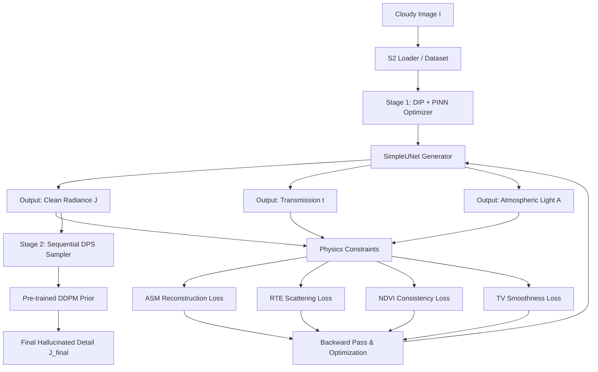

# CloudVision AI — Project Architecture & Walkthrough

This document provides a detailed overview of the system architecture, mathematical formulations, technology stack, and file-by-file functionality of the **Physics-Informed Deep Image Prior (DIP+PINN) Cloud Removal System**.

---

## 1. System Architecture

The project implements a **two-stage hybrid cloud removal pipeline** designed for Sentinel-2 multispectral imagery and the RICE benchmark datasets. It operates entirely **without ground-truth clear imagery**, relying instead on physical consistency constraints and generative priors.

### Stage 1: Physics-Informed Deep Image Prior (DIP+PINN)
- **Concept**: Instead of training a network on thousands of images, a U-Net is optimized on a **single cloudy image**. The network's parameters act as a structural prior (Deep Image Prior), preventing the model from fitting high-frequency noise or clouds, while physical equations guide the reconstruction.
- **Outputs**:
  - $J(x)$ : Clean scene radiance estimate (reflection from the ground).
  - $t(x)$ : Transmission map (fraction of light reaching the sensor without scattering).
  - $A$ : Atmospheric light vector (ambient light scattered by clouds/haze).

### Stage 2: Diffusion Posterior Sampling (DPS) Prior (Optional)
- For thick clouds where no ground information remains, Stage 1 provides a low-frequency structure. Stage 2 uses a frozen pre-trained Diffusion model (DDPM) to hallucinate high-frequency texture details under the cloud mask while maintaining consistency with clear regions.

---

## 2. Mathematical Formulations

### 2.1 Atmospheric Scattering Model (ASM)
The forward physical model describes the captured cloudy image $I(x)$ as a combination of clean scene radiance $J(x)$ and ambient atmospheric light $A$:
$$I(x) = J(x) \odot t(x) + A \odot (1 - t(x))$$

### 2.2 Radiative Transfer Equation (RTE)
To enforce physical consistency across multiple spectral bands, transmission $t_b(x)$ for band $b$ is modeled as a function of wavelength $\lambda_b$:
$$t_b(x) = e^{-\tau_b(x)}$$
Where the optical depth $\tau_b(x)$ is defined by Rayleigh scattering, Mie scattering, and gas absorption:
$$\tau_b(x) = \left( \beta_R(\lambda_b) + \beta_{abs}(\lambda_b) \right) \cdot d(x) + \beta_M(\lambda_b) \cdot d(x) \cdot c_M(x)$$
- Rayleigh Scattering: $\beta_R(\lambda_b) = 0.008569 \cdot \lambda_b^{-4}$
- Mie Scattering: $\beta_M(\lambda_b) = \lambda_b^{-\alpha}$ (with Ångström exponent $\alpha \approx 1.3$)
- $\beta_{abs}(\lambda_b)$ : Gas absorption coefficients.
- $d(x)$ : Physical scene depth.
- $c_M(x)$ : Aerosol concentration.

The model solves for $d(x)$ and $c_M(x)$ pixel-wise using a linear least-squares solver (pseudo-inverse of the scattering coefficient matrix), ensuring that the predicted transmission map is physically plausible.

### 2.3 NDVI Consistency Loss
Enforces that the Normalized Difference Vegetation Index (NDVI) is preserved in clear areas and varies smoothly in cloudy areas:
$$\text{NDVI} = \frac{\text{NIR} - \text{Red}}{\text{NIR} + \text{Red}}$$
- **Clear Pixels**: Matches the reconstructed NDVI with the input NDVI.
- **Cloudy Pixels**: Minimizes the spatial gradients of the reconstructed NDVI to ensure smooth transitions.

---

## 3. Technology Stack

- **Backend**: FastAPI (Python 3.12)
- **Machine Learning**: PyTorch 2.5.1 + CUDA 12.1 (GPU acceleration enabled)
- **Geospatial & Image Handling**: Rasterio (GDAL-based GeoTIFF reader), OpenCV-Python, Pillow
- **Frontend**: Vanilla HTML5, CSS3 (Glassmorphism & animations), JavaScript (ES6+, Chart.js, Server-Sent Events)

---

## 4. File-by-File Explanation

### 4.1 Core ML & Physical Logic

#### 1. [`losses.py`](file:///c:/Users/01soj/Downloads/Pinn+dipp/losses.py)
Implements all physics-informed losses and the diffusion prior:
- `PINNLosses.asm_loss`: Measures difference between forward model and input image.
- `PINNLosses.masked_recon_loss`: Restricts reconstruction loss to clear pixels.
- `PINNLosses.rte_loss`: Sets up the multi-spectral scattering system and fits scene parameters using least squares.
- `PINNLosses.ndvi_consistency_loss`: Computes vegetation index constraints.
- `DPSPrior`: Manages the DDPM pipeline and calculates the conditional guidance gradients.

#### 2. [`dip_loop.py`](file:///c:/Users/01soj/Downloads/Pinn+dipp/dip_loop.py)
Coordinates the U-Net optimization loop:
- `SimpleUNet`: Generates $J$, $t$, and parameterizes $A$.
- `estimate_atmospheric_light_dcp`: Estimates atmospheric vector $A$ from the brightest 0.1% pixels in the Dark Channel Prior (DCP).
- `optimize_dip`: Prepares tensors, initializes the generator with OpenCV-inpainted seeds, and runs the backpropagation loop. Calls SSE callbacks to update the web UI in real-time.

#### 3. [`prs_metric.py`](file:///c:/Users/01soj/Downloads/Pinn+dipp/prs_metric.py)
Computes the **Physical Realism Score (PRS)**, a no-reference metric evaluating:
- ASM reconstruction residuals.
- Spectral Angle Mapper (SAM) deviation.
- NDVI spatial smoothness.

---

### 4.2 Web Server & API

#### 4. [`main.py`](file:///c:/Users/01soj/Downloads/Pinn+dipp/main.py)
The entry point. Reads command line arguments (e.g., `--inspect-data`) and runs Uvicorn on `127.0.0.1:8000`.

#### 5. [`app.py`](file:///c:/Users/01soj/Downloads/Pinn+dipp/app.py)
Houses all backend APIs:
- `/api/overview`: Returns dataset stats and loaded Sentinel-2 metadata.
- `/api/rice/sample` / `/api/rice/benchmark`: Serves RICE dataset thumbnails and triggers RICE benchmarks.
- `/api/s2/crop` / `/api/s2/optimize`: Extracts windowed crops from Sentinel-2 jp2 bands, and spawns the optimization thread returning Server-Sent Events (SSE).
- `/api/classify`: Calls U-Net to segment clouds and generates explainability heatmaps using PyTorch Autograd (saliency maps).

---

### 4.3 Data Loaders & Pipelines

#### 6. [`s2_loader.py`](file:///c:/Users/01soj/Downloads/Pinn+dipp/s2_loader.py)
Custom loader for Sentinel-2 folders:
- Scans `GRANULE` structures for B02, B03, B04, B08, SCL, and TCI bands.
- Upsamples SCL (20m) to 10m to match RGB/NIR bands.
- Performs windowed reads using Rasterio to fetch crops in milliseconds without reading the entire 100MB+ band files into RAM.
- **[Fixed Bug]** Now clips band values to `[0.0, 1.0]` to prevent model saturation and loss freezing.

#### 7. [`datasets.py`](file:///c:/Users/01soj/Downloads/Pinn+dipp/datasets.py)
Loads benchmark samples from local directories for RICE1 and RICE2.

---

### 4.4 CLI & Offline Execution

#### 8. [`reconstruct_s2.py`](file:///c:/Users/01soj/Downloads/Pinn+dipp/reconstruct_s2.py)
Processes full or cropped tiles patch-by-patch using DIP+PINN, applying a linear blending window to stitch patches back together seamlessly.

#### 9. [`inference_full_tile.py`](file:///c:/Users/01soj/Downloads/Pinn+dipp/inference_full_tile.py)
A CLI tool that loads a full Sentinel-2 tile, classifies patches into clear or cloudy, and processes only the cloudy patches to stitch them back with a feathering boundary.

#### 10. [`evaluate.py`](file:///c:/Users/01soj/Downloads/Pinn+dipp/evaluate.py)
Evaluates and benchmarks multiple model variants (DCP, DIP, DIP+PINN, and DIP+PINN+DPS) on RICE, generating a markdown benchmark report.

#### 11. Additional Utils
- **[`processing.py`](file:///c:/Users/01soj/Downloads/Pinn+dipp/processing.py)**: Helper utilities for image and geospatial processing.
- **[`feature_extractor.py`](file:///c:/Users/01soj/Downloads/Pinn+dipp/feature_extractor.py)**: Extracts deep features for perceptual loss or metric evaluation.
- **[`inference_cloud_removal.py`](file:///c:/Users/01soj/Downloads/Pinn+dipp/inference_cloud_removal.py)**: Inference script dedicated to running cloud removal models on targeted patches.

---

## 5. Frontend Walkthrough

- **[`web/templates/index.html`](file:///c:/Users/01soj/Downloads/Pinn+dipp/web/templates/index.html)**: Layout shell containing the Dataset Browser sidebar and work tabs (Detection, Removal, U-Net Classify, RICE Benchmark, Sentinel-2, Metrics).
- **[`web/static/app.js`](file:///c:/Users/01soj/Downloads/Pinn+dipp/web/static/app.js)**: Core Javascript logic. Manages UI state, canvas click coordinate mapping, SSE event streams from the optimizer, and renders Chart.js charts.
- **[`web/static/styles.css`](file:///c:/Users/01soj/Downloads/Pinn+dipp/web/static/styles.css)**: Renders glassmorphic card elements, custom neon glow effects, and transitions.

---

## 6. How Optimization Works in Real-time

1. Clicking a coordinate on the Sentinel-2 canvas map calculates the relative $(x, y)$ coordinates on the full $10980\times10980$ pixel tile.
2. The backend extracts the 4-channel crop (RGB+NIR) and the Scene Classification Layer (SCL) cloud mask.
3. The generator U-Net starts optimizing on the GPU (GTX 1650).
4. Every 20 iterations, the server converts the intermediate clean image $J$ to base64 and pushes it through the SSE stream to the frontend.
5. The frontend displays the restored image instantly and updates the Chart.js convergence chart showing the decreasing ASM, RTE, and NDVI losses.
6. Once complete, the final metrics (PSNR, SSIM, SAM, PRS, and Runtime) are calculated and displayed.
