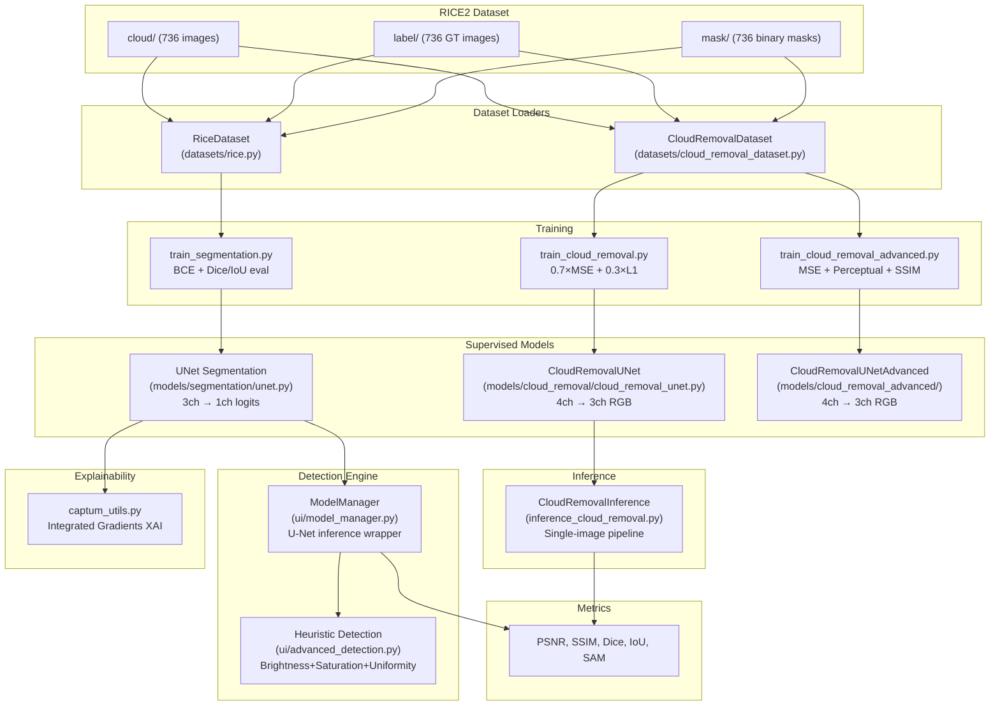
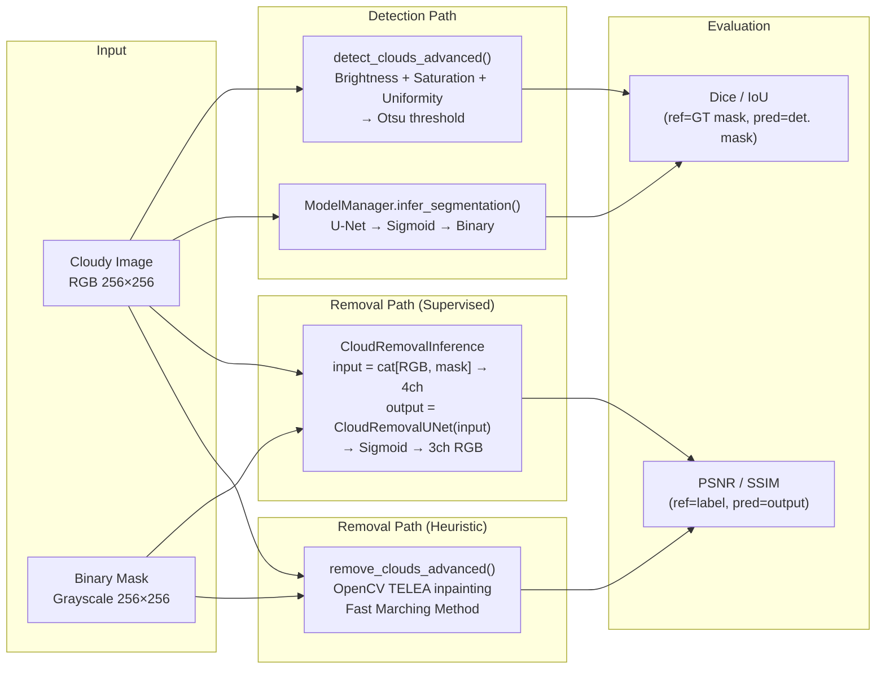
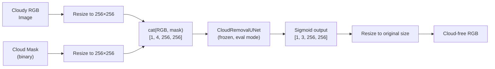
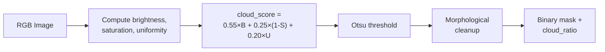
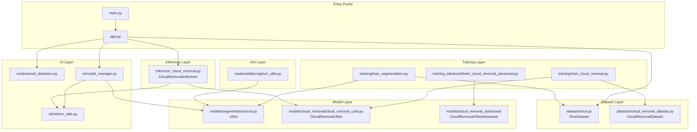

# 🧠 RICE 2 Explorer Tab — Complete File & Code Map

> **Scope**: This document covers *only* the **RICE2 (thick/dense cloud)** pipeline — the dataset, the supervised models trained on it, the detection/segmentation subsystem, the training scripts, the loss functions, and the inference engines that consume RICE2 data. It is intentionally separated from the DIP+PINN zero-shot cloud removal engine.

---

## 📑 Table of Contents

1. [What Is RICE2?](#1-what-is-rice2)
2. [Dataset Layout & Specification](#2-dataset-layout--specification)
3. [Complete File Map](#3-complete-file-map)
4. [Architecture Diagram](#4-architecture-diagram)
5. [Data Flow Diagram](#5-data-flow-diagram)
6. [Class & Function Reference](#6-class--function-reference)
7. [Model Architecture Reference](#7-model-architecture-reference)
8. [Loss Function Reference](#8-loss-function-reference)
9. [Training Pipeline Reference](#9-training-pipeline-reference)
10. [Inference Pipeline Reference](#10-inference-pipeline-reference)
11. [Metrics Reference](#11-metrics-reference)
12. [Configuration & Hyperparameters](#12-configuration--hyperparameters)
13. [Dependency Graph](#13-dependency-graph)
14. [Key API Endpoints (RICE2)](#14-key-api-endpoints-rice2)

---

## 1. What Is RICE2?

| Property | Value |
|:---|:---|
| **Full Name** | RICE-II (Real-world Cloud Cover Dataset) |
| **Samples** | 736 triplets |
| **Channels** | 3 (RGB) + Binary Cloud Mask |
| **Source** | Landsat-8 OLI/TIRS real cloud cover |
| **Ground Truth** | Semi-paired: `cloud/` (cloudy), `label/` (cloud-free GT), `mask/` (binary cloud mask) |
| **Resolution** | 256 × 256 pixels |
| **Cloud Type** | **Thick / Dense / Opaque** clouds (vs. RICE1 which is thin/synthetic) |
| **Primary Uses** | Supervised cloud removal training, U-Net cloud segmentation training, heuristic cloud detection benchmarks |

> [!IMPORTANT]
> RICE2 has **ground-truth binary masks** (`mask/`), which RICE1 does not. This is what enables supervised segmentation training (U-Net) and mask-conditioned supervised cloud removal (CloudRemovalUNet).

---

## 2. Dataset Layout & Specification

```
RICE_DATASET/
└── RICE2/
    ├── cloud/     → 736 cloudy RGB images (256×256 PNG/JPG)
    ├── label/     → 736 cloud-free ground truth RGB images (matched filenames)
    └── mask/      → 736 binary cloud masks (grayscale, 0=clear, 255=cloud)
```

### File Correspondence

Each sample `i` has three corresponding files with the **same filename** across subdirectories:

| Directory | Role | Format | Example |
|:---|:---|:---|:---|
| [`RICE2/cloud/`](file:///c:/Users/01soj/Downloads/Pinn+dipp/RICE_DATASET/RICE2/cloud) | Cloudy input | RGB PNG | `0001.png` |
| [`RICE2/label/`](file:///c:/Users/01soj/Downloads/Pinn+dipp/RICE_DATASET/RICE2/label) | Cloud-free GT | RGB PNG | `0001.png` |
| [`RICE2/mask/`](file:///c:/Users/01soj/Downloads/Pinn+dipp/RICE_DATASET/RICE2/mask) | Binary mask | Grayscale PNG | `0001.png` |

---

## 3. Complete File Map

### 3.1 Dataset Loaders

| File | Purpose | Key Classes / Functions |
|:---|:---|:---|
| [`datasets/rice.py`](file:///c:/Users/01soj/Downloads/Pinn+dipp/datasets/rice.py) | General RICE dataset (RICE1 + RICE2), PyTorch `Dataset` | `RiceDataset`, `RiceSample` |
| [`datasets/cloud_removal_dataset.py`](file:///c:/Users/01soj/Downloads/Pinn+dipp/datasets/cloud_removal_dataset.py) | RICE-II specific 4-channel (RGB+mask→GT) loader for supervised training | `CloudRemovalDataset`, `get_dataloaders()` |
| [`datasets/__init__.py`](file:///c:/Users/01soj/Downloads/Pinn+dipp/datasets/__init__.py) | Package init | Exports |
| [`datasets.py`](file:///c:/Users/01soj/Downloads/Pinn+dipp/datasets.py) | Root forwarding module (resolves name collision) | `from datasets.rice import RICEDataset` |

### 3.2 Models (RICE2-Specific)

| File | Purpose | Key Classes |
|:---|:---|:---|
| [`models/segmentation/unet.py`](file:///c:/Users/01soj/Downloads/Pinn+dipp/models/segmentation/unet.py) | U-Net for cloud **segmentation** (3ch→1ch) trained on RICE2 masks | `UNet`, `DoubleConv` |
| [`models/segmentation/unet_rice2.pth`](file:///c:/Users/01soj/Downloads/Pinn+dipp/models/segmentation/unet_rice2.pth) | Trained segmentation weights (~124 MB) | — |
| [`models/cloud_removal/cloud_removal_unet.py`](file:///c:/Users/01soj/Downloads/Pinn+dipp/models/cloud_removal/cloud_removal_unet.py) | Supervised CloudRemovalUNet (4ch→3ch), ISRO architecture | `CloudRemovalUNet`, `DoubleConv`, `Down`, `Up` |
| [`models/cloud_removal/best_model.pth`](file:///c:/Users/01soj/Downloads/Pinn+dipp/models/cloud_removal/best_model.pth) | Best trained supervised removal weights (~372 MB) | — |
| [`models/cloud_removal/checkpoint_epoch_*.pth`](file:///c:/Users/01soj/Downloads/Pinn+dipp/models/cloud_removal) | Per-epoch checkpoints (50 epochs) | — |
| [`models/cloud_removal_advanced/cloud_removal_unet_advanced.py`](file:///c:/Users/01soj/Downloads/Pinn+dipp/models/cloud_removal_advanced/cloud_removal_unet_advanced.py) | Advanced variant with deeper encoder | `CloudRemovalUNetAdvanced` |
| [`models/cloud_removal_advanced/advanced_losses.py`](file:///c:/Users/01soj/Downloads/Pinn+dipp/models/cloud_removal_advanced/advanced_losses.py) | Advanced losses (Perceptual VGG + SSIM) | `PerceptualLoss`, `SSIMLoss` |
| [`models/cloud_removal_advanced/best_model_advanced.pth`](file:///c:/Users/01soj/Downloads/Pinn+dipp/models/cloud_removal_advanced/best_model_advanced.pth) | Advanced trained weights (~372 MB) | — |
| [`models/__init__.py`](file:///c:/Users/01soj/Downloads/Pinn+dipp/models/__init__.py) | Package init | — |

### 3.3 Training Scripts

| File | Purpose | Key Functions |
|:---|:---|:---|
| [`training/train_segmentation.py`](file:///c:/Users/01soj/Downloads/Pinn+dipp/training/train_segmentation.py) | Trains U-Net segmentation on RICE2 masks | `main()`, `train_one_epoch()`, `evaluate()` |
| [`training/train_cloud_removal.py`](file:///c:/Users/01soj/Downloads/Pinn+dipp/training/train_cloud_removal.py) | Supervised CloudRemovalUNet training (ISRO method) | `CombinedLoss`, training loop, TensorBoard logging |
| [`training/losses.py`](file:///c:/Users/01soj/Downloads/Pinn+dipp/training/losses.py) | Training-specific losses (separate from inference losses) | — |
| [`training_advanced/train_cloud_removal_advanced.py`](file:///c:/Users/01soj/Downloads/Pinn+dipp/training_advanced/train_cloud_removal_advanced.py) | Advanced supervised training with perceptual+SSIM losses | — |

### 3.4 Inference & Detection

| File | Purpose | Key Classes / Functions |
|:---|:---|:---|
| [`inference_cloud_removal.py`](file:///c:/Users/01soj/Downloads/Pinn+dipp/inference_cloud_removal.py) | Supervised CloudRemovalUNet inference pipeline | `CloudRemovalInference` |
| [`ui/advanced_detection.py`](file:///c:/Users/01soj/Downloads/Pinn+dipp/ui/advanced_detection.py) | Heuristic cloud detection tuned for RICE2 thick clouds | `detect_clouds_advanced()`, `detect_clouds_patch_based()`, `remove_clouds_advanced()` |
| [`ui/model_manager.py`](file:///c:/Users/01soj/Downloads/Pinn+dipp/ui/model_manager.py) | Model loading & U-Net segmentation inference | `ModelManager` |
| [`ui/metrics_utils.py`](file:///c:/Users/01soj/Downloads/Pinn+dipp/ui/metrics_utils.py) | Image quality metrics (PSNR, SSIM, Dice, IoU) | `psnr()`, `ssim()`, `dice()`, `iou()`, `calc_metrics()` |

### 3.5 Metrics & Evaluation

| File | Purpose | Key Functions |
|:---|:---|:---|
| [`metrics/segmentation_metrics.py`](file:///c:/Users/01soj/Downloads/Pinn+dipp/metrics/segmentation_metrics.py) | Dice & IoU for segmentation evaluation | `dice_score()`, `iou_score()` |
| [`evaluate.py`](file:///c:/Users/01soj/Downloads/Pinn+dipp/evaluate.py) | Multi-variant benchmark (DCP, DIP, DIP+PINN, DIP+PINN+DPS) | `evaluate_benchmarks()`, `run_dcp_baseline()` |
| [`calculate_metrics_cli.py`](file:///c:/Users/01soj/Downloads/Pinn+dipp/calculate_metrics_cli.py) | CLI for computing metrics on saved outputs | — |

### 3.6 Explainability

| File | Purpose | Key Functions |
|:---|:---|:---|
| [`explainability/captum_utils.py`](file:///c:/Users/01soj/Downloads/Pinn+dipp/explainability/captum_utils.py) | Integrated Gradients XAI for U-Net cloud classification | `generate_unet_explanation()`, `normalize_attribution()` |

### 3.7 Hyperparameter Profiles

| Directory | Purpose |
|:---|:---|
| [`hyperparameter_profiles/RICE2/`](file:///c:/Users/01soj/Downloads/Pinn+dipp/hyperparameter_profiles/RICE2) | Per-sample optimal hyperparameter JSON profiles (sample_2.json, sample_21.json, ...) |

### 3.8 Scripts & Utilities

| File | Purpose |
|:---|:---|
| [`scripts/inspect_dataset.py`](file:///c:/Users/01soj/Downloads/Pinn+dipp/scripts/inspect_dataset.py) | Prints dataset statistics for RICE1/RICE2 |
| [`scripts/calculate_optimal_hyperparameters.py`](file:///c:/Users/01soj/Downloads/Pinn+dipp/scripts/calculate_optimal_hyperparameters.py) | Computes per-sample physical hyperparameters for RICE2 |
| [`scripts/generate_docx_article.py`](file:///c:/Users/01soj/Downloads/Pinn+dipp/scripts/generate_docx_article.py) | Generates research article DOCX with RICE2 results |

### 3.9 Web Application (RICE2-related endpoints)

| File | Purpose |
|:---|:---|
| [`app.py`](file:///c:/Users/01soj/Downloads/Pinn+dipp/app.py) | FastAPI server — RICE2 gallery, benchmark, detection, removal endpoints |
| [`web/templates/index.html`](file:///c:/Users/01soj/Downloads/Pinn+dipp/web/templates/index.html) | Frontend — RICE2 dataset browser, detection tab, results viewer |
| [`web/static/app.js`](file:///c:/Users/01soj/Downloads/Pinn+dipp/web/static/app.js) | JS logic — RICE2 gallery navigation, SSE streaming |
| [`web/static/styles.css`](file:///c:/Users/01soj/Downloads/Pinn+dipp/web/static/styles.css) | Glassmorphic dark-mode styling |

### 3.10 Configuration

| File | Purpose |
|:---|:---|
| [`configs/default.yaml`](file:///c:/Users/01soj/Downloads/Pinn+dipp/configs/default.yaml) | Global settings: `dataset_root`, `image_size: 256`, `batch_size: 4`, `lr: 0.0001` |

---

## 4. Architecture Diagram



---

## 5. Data Flow Diagram



---

## 6. Class & Function Reference

### 6.1 `RiceDataset` — [`datasets/rice.py`](file:///c:/Users/01soj/Downloads/Pinn+dipp/datasets/rice.py)

```python
class RiceDataset(Dataset):
    def __init__(self, root_dir, split="RICE2", image_size=256)
    def __getitem__(self, idx) → dict:
        # Returns: {"image": [3,H,W], "target": [3,H,W], "mask": [1,H,W], "has_mask": bool, "name": str}
```

| Method | Returns | Description |
|:---|:---|:---|
| `_build_samples()` | `list[RiceSample]` | Scans `cloud/`, `label/`, `mask/` dirs, builds matched triplets |
| `__getitem__(idx)` | `dict` | Loads images, resizes to `image_size`, applies augmentations |
| `__len__()` | `int` | Number of samples in split |

### 6.2 `CloudRemovalDataset` — [`datasets/cloud_removal_dataset.py`](file:///c:/Users/01soj/Downloads/Pinn+dipp/datasets/cloud_removal_dataset.py)

```python
class CloudRemovalDataset(Dataset):
    def __init__(self, root_dir, image_size=256)
    def __getitem__(self, idx) → (input_tensor[4,256,256], target_tensor[3,256,256])
```

| Function | Purpose |
|:---|:---|
| `get_dataloaders(root, batch_size, val_split, ...)` | Returns `(train_loader, val_loader)` with 80/20 split |

### 6.3 `UNet` (Segmentation) — [`models/segmentation/unet.py`](file:///c:/Users/01soj/Downloads/Pinn+dipp/models/segmentation/unet.py)

```python
class UNet(nn.Module):
    def __init__(self, in_channels=3, out_channels=1, features=(64, 128, 256, 512))
    def forward(self, x) → logits  # [B, 1, H, W] raw logits (apply sigmoid for probabilities)
```

| Component | Architecture |
|:---|:---|
| **Encoder** | 4 stages: `DoubleConv` → `MaxPool2d(2)` — channels: 3→64→128→256→512 |
| **Bottleneck** | `DoubleConv(512, 1024)` |
| **Decoder** | 4 stages: `ConvTranspose2d(2)` → `cat(skip)` → `DoubleConv` — channels: 1024→512→256→128→64 |
| **Head** | `Conv2d(64, 1, kernel=1)` — raw logits |
| **Weights** | [`unet_rice2.pth`](file:///c:/Users/01soj/Downloads/Pinn+dipp/models/segmentation/unet_rice2.pth) (~124 MB) |

### 6.4 `CloudRemovalUNet` (Supervised) — [`models/cloud_removal/cloud_removal_unet.py`](file:///c:/Users/01soj/Downloads/Pinn+dipp/models/cloud_removal/cloud_removal_unet.py)

```python
class CloudRemovalUNet(nn.Module):
    def __init__(self, in_channels=4, out_channels=3)
    def forward(self, x) → output  # [B, 3, H, W] Sigmoid-bounded [0, 1]
```

| Component | Architecture |
|:---|:---|
| **Input** | 4 channels: `cat(RGB_cloudy[3], binary_mask[1])` |
| **Encoder** | `DoubleConv(4,64)` → `Down(64,128)` → `Down(128,256)` → `Down(256,512)` |
| **Bottleneck** | `Down(512, 1024)` |
| **Decoder** | `Up(1024,512)` → `Up(512,256)` → `Up(256,128)` → `Up(128,64)` |
| **Head** | `Conv2d(64, 3, kernel=1)` → `Sigmoid` |
| **Parameters** | ~31.04 million |
| **Weights** | [`best_model.pth`](file:///c:/Users/01soj/Downloads/Pinn+dipp/models/cloud_removal/best_model.pth) (~372 MB) |

### 6.5 `CloudRemovalUNetAdvanced` — [`models/cloud_removal_advanced/cloud_removal_unet_advanced.py`](file:///c:/Users/01soj/Downloads/Pinn+dipp/models/cloud_removal_advanced/cloud_removal_unet_advanced.py)

Same encoder-decoder architecture as `CloudRemovalUNet` but trained with additional perceptual and SSIM losses for higher fidelity.

### 6.6 `ModelManager` — [`ui/model_manager.py`](file:///c:/Users/01soj/Downloads/Pinn+dipp/ui/model_manager.py)

```python
class ModelManager:
    def load_segmentation_model(model_path=None) → UNet
    def infer_segmentation(image, threshold=0.5) → (mask_image, pred_mask)
    def classify_cloud(mask) → {"cloud_free": 0.0, "thin_cloud": 0.0, "thick_cloud": 0.0, "cirrus": 0.0}
    def apply_removal_filter(image, mask) → Image
```

### 6.7 `CloudRemovalInference` — [`inference_cloud_removal.py`](file:///c:/Users/01soj/Downloads/Pinn+dipp/inference_cloud_removal.py)

```python
class CloudRemovalInference:
    def __init__(self, checkpoint_path=None, device=None, image_size=256)
    # Loads CloudRemovalUNet, auto-finds best_model.pth
    # Preprocessing: resize → cat(RGB, mask) → 4ch tensor
    # Postprocessing: model(input) → Sigmoid → clamp [0,1] → resize back
```

### 6.8 Detection Functions — [`ui/advanced_detection.py`](file:///c:/Users/01soj/Downloads/Pinn+dipp/ui/advanced_detection.py)

| Function | Signature | Returns |
|:---|:---|:---|
| `detect_clouds_advanced()` | `(image, method="multi_spectral", sensitivity=0.75)` | `(mask_image, cloud_ratio)` |
| `detect_clouds_patch_based()` | `(image, sensitivity=0.75)` | `(mask_image, cloud_ratio)` |
| `remove_clouds_advanced()` | `(image, mask, strength=1.0, reference_image=None)` | `inpainted_image` |

**Detection Algorithm** (tuned for RICE2 thick clouds):
```
cloud_score = 0.55 × brightness + 0.25 × (1 - saturation) + 0.20 × uniformity
threshold = Otsu(cloud_score) + (0.75 - sensitivity) × 0.03
→ binary closing → binary opening → fill holes → uniform filter cleanup
```

### 6.9 `generate_unet_explanation()` — [`explainability/captum_utils.py`](file:///c:/Users/01soj/Downloads/Pinn+dipp/explainability/captum_utils.py)

```python
def generate_unet_explanation(model, input_tensor, device) → PIL.Image
    # Uses Captum IntegratedGradients (15 steps)
    # Baseline: zero (black image)
    # Returns: inferno-colored heatmap showing pixel importance for cloud classification
```

---

## 7. Model Architecture Reference

### Segmentation UNet (Cloud Mask Prediction)

```
Input: [B, 3, 256, 256] RGB cloudy image
  ↓
Encoder Stage 1: DoubleConv(3→64)  → [B, 64, 256, 256]   ← skip₁
  MaxPool2d(2)
Encoder Stage 2: DoubleConv(64→128) → [B, 128, 128, 128]  ← skip₂
  MaxPool2d(2)
Encoder Stage 3: DoubleConv(128→256) → [B, 256, 64, 64]   ← skip₃
  MaxPool2d(2)
Encoder Stage 4: DoubleConv(256→512) → [B, 512, 32, 32]   ← skip₄
  MaxPool2d(2)
  ↓
Bottleneck: DoubleConv(512→1024) → [B, 1024, 16, 16]
  ↓
Decoder Stage 1: ConvTranspose2d(1024→512) + cat(skip₄) → DoubleConv(1024→512)
Decoder Stage 2: ConvTranspose2d(512→256)  + cat(skip₃) → DoubleConv(512→256)
Decoder Stage 3: ConvTranspose2d(256→128)  + cat(skip₂) → DoubleConv(256→128)
Decoder Stage 4: ConvTranspose2d(128→64)   + cat(skip₁) → DoubleConv(128→64)
  ↓
Head: Conv2d(64→1, kernel=1) → logits
  ↓
Output: [B, 1, 256, 256] → Sigmoid → Binary mask (threshold=0.5)
```

### CloudRemovalUNet (Supervised Cloud Removal)

```
Input: [B, 4, 256, 256] = cat(RGB_cloudy, binary_mask)
  ↓
Encoder:  4→64→128→256→512  (same structure as above)
Bottleneck: 512→1024
Decoder:  1024→512→256→128→64  (skip connections)
  ↓
Head: Conv2d(64→3, kernel=1) → Sigmoid
  ↓
Output: [B, 3, 256, 256] reconstructed cloud-free RGB in [0, 1]
```

---

## 8. Loss Function Reference

### 8.1 Supervised Training Loss ([`training/train_cloud_removal.py`](file:///c:/Users/01soj/Downloads/Pinn+dipp/training/train_cloud_removal.py#L37-L52))

```python
class CombinedLoss:
    loss = 0.7 × MSE(pred, target) + 0.3 × L1(pred, target)
```

> From Nikita Zade's ISRO Internship Report. MSE ensures radiometric accuracy; L1 preserves sharp edges.

### 8.2 Segmentation Training Loss ([`training/train_segmentation.py`](file:///c:/Users/01soj/Downloads/Pinn+dipp/training/train_segmentation.py#L65))

```python
criterion = nn.BCEWithLogitsLoss()
```

### 8.3 Advanced Training Losses ([`models/cloud_removal_advanced/advanced_losses.py`](file:///c:/Users/01soj/Downloads/Pinn+dipp/models/cloud_removal_advanced/advanced_losses.py))

| Loss | Class | Description |
|:---|:---|:---|
| **Perceptual** | `PerceptualLoss` | VGG-16 feature matching (conv1_2, conv2_2, conv3_3, conv4_3) |
| **SSIM** | `SSIMLoss` | Structural similarity with Gaussian windowing |

---

## 9. Training Pipeline Reference

### 9.1 Segmentation Training

| Property | Value |
|:---|:---|
| **Script** | [`training/train_segmentation.py`](file:///c:/Users/01soj/Downloads/Pinn+dipp/training/train_segmentation.py) |
| **Dataset** | `RiceDataset(split="RICE2")` |
| **Model** | `UNet(in_channels=3, out_channels=1)` |
| **Loss** | `BCEWithLogitsLoss` |
| **Optimizer** | `Adam(lr=1e-3)` |
| **Epochs** | 3 (quick baseline) |
| **Batch Size** | 8 |
| **Evaluation** | Dice score, IoU score per epoch |
| **Output** | [`unet_rice2.pth`](file:///c:/Users/01soj/Downloads/Pinn+dipp/models/segmentation/unet_rice2.pth) |

### 9.2 Supervised Cloud Removal Training

| Property | Value |
|:---|:---|
| **Script** | [`training/train_cloud_removal.py`](file:///c:/Users/01soj/Downloads/Pinn+dipp/training/train_cloud_removal.py) |
| **Dataset** | `CloudRemovalDataset(RICE_DATASET/RICE2)` — 4ch input, 3ch target |
| **Model** | `CloudRemovalUNet(in_channels=4, out_channels=3)` |
| **Loss** | `0.7×MSE + 0.3×L1` |
| **Optimizer** | `Adam(lr=1e-4)` |
| **Scheduler** | `ReduceLROnPlateau(patience=2)` |
| **Epochs** | 50 |
| **Checkpointing** | Best model + per-epoch saves |
| **Visualization** | 4-panel comparison plots per epoch |
| **Logging** | TensorBoard via `SummaryWriter` |
| **Output** | [`best_model.pth`](file:///c:/Users/01soj/Downloads/Pinn+dipp/models/cloud_removal/best_model.pth) + 50 epoch checkpoints |

### 9.3 Advanced Cloud Removal Training

| Property | Value |
|:---|:---|
| **Script** | [`training_advanced/train_cloud_removal_advanced.py`](file:///c:/Users/01soj/Downloads/Pinn+dipp/training_advanced/train_cloud_removal_advanced.py) |
| **Dataset** | `RICE_DATASET/RICE2` (default `--dataset` argument) |
| **Model** | `CloudRemovalUNetAdvanced(in_channels=4, out_channels=3)` |
| **Loss** | MSE + PerceptualLoss (VGG-16) + SSIMLoss |
| **Output** | [`best_model_advanced.pth`](file:///c:/Users/01soj/Downloads/Pinn+dipp/models/cloud_removal_advanced/best_model_advanced.pth) |

---

## 10. Inference Pipeline Reference

### 10.1 Supervised Cloud Removal Inference



**Code path**: [`inference_cloud_removal.py`](file:///c:/Users/01soj/Downloads/Pinn+dipp/inference_cloud_removal.py) → `CloudRemovalInference.__init__()` → loads `best_model.pth`

### 10.2 Heuristic Cloud Detection Inference



**Code path**: [`ui/advanced_detection.py`](file:///c:/Users/01soj/Downloads/Pinn+dipp/ui/advanced_detection.py) → `detect_clouds_advanced()` → `detect_clouds_patch_based()`

### 10.3 U-Net Segmentation Inference


**Code path**: [`ui/model_manager.py`](file:///c:/Users/01soj/Downloads/Pinn+dipp/ui/model_manager.py) → `ModelManager.infer_segmentation()`

---

## 11. Metrics Reference

| Metric | Full Name | Direction | Used For | Implementation |
|:---|:---|:---|:---|:---|
| **PSNR** | Peak Signal-to-Noise Ratio (dB) | ↑ Higher = Better | Cloud removal quality | `skimage.metrics.peak_signal_noise_ratio` |
| **SSIM** | Structural Similarity Index | ↑ Higher = Better | Cloud removal quality | `skimage.metrics.structural_similarity` |
| **Dice** | Dice Coefficient | ↑ Higher = Better | Segmentation accuracy | `2×intersection / (|pred| + |target|)` |
| **IoU** | Intersection over Union | ↑ Higher = Better | Segmentation accuracy | `intersection / union` |
| **SAM** | Spectral Angle Mapper (radians) | ↓ Lower = Better | Spectral fidelity | `arccos(dot / (‖a‖×‖b‖))` |

**Reported Benchmark** (from project docs):
- U-Net on RICE2: **IoU = 0.815**, **Dice = 0.898**

---

## 12. Configuration & Hyperparameters

### Global Config — [`configs/default.yaml`](file:///c:/Users/01soj/Downloads/Pinn+dipp/configs/default.yaml)

```yaml
project:
  name: cloud_ai_project
  dataset_root: ../RICE_DATASET
  image_size: 256
  batch_size: 4
  num_workers: 0
  seed: 42
training:
  epochs: 20
  lr: 0.0001
  device: auto
```

### Per-Sample Hyperparameter Profiles

Each file in [`hyperparameter_profiles/RICE2/`](file:///c:/Users/01soj/Downloads/Pinn+dipp/hyperparameter_profiles/RICE2) contains a JSON with physically-computed optimal parameters (scattering coefficients, transmission ranges, cloud density) for individual RICE2 samples.

---

## 13. Dependency Graph



---

## 14. Key API Endpoints (RICE2)

These are the [`app.py`](file:///c:/Users/01soj/Downloads/Pinn+dipp/app.py) endpoints that specifically serve or process RICE2 data:

| Endpoint | Method | Purpose |
|:---|:---|:---|
| `/api/overview` | GET | Returns `rice2_count: 736` and dataset metadata |
| `/api/rice/sample` | GET | Serves RICE2 sample thumbnails (cloudy, label, mask) |
| `/api/rice/benchmark` | POST | Triggers DIP+PINN benchmark on RICE2 samples |
| `/api/classify` | POST | U-Net segmentation + Captum XAI heatmap on uploaded image |
| `/api/detect` | POST | Heuristic cloud detection (advanced_detection.py) |
| `/api/remove` | POST | Supervised CloudRemovalUNet inference |

### RICE2 vs RICE1 Detection Logic in `app.py`

```python
# RICE2 samples use ground-truth masks when available
"mask_source": "Ground Truth" if (split == "RICE2" and mask_img) else "Predicted (U-Net)"

# RICE2 mask is used directly for supervised removal
if split == "RICE2" and mask_img is not None:
    # Use GT mask instead of predicted mask
```

---

> [!TIP]
> To run the complete RICE2 pipeline end-to-end:
> 1. Train segmentation: `python training/train_segmentation.py`
> 2. Train supervised removal: `python training/train_cloud_removal.py --dataset RICE_DATASET/RICE2`
> 3. Start the web app: `python main.py` → open `http://127.0.0.1:5000`
> 4. Navigate to RICE2 in the dataset gallery to browse, detect, and remove clouds
